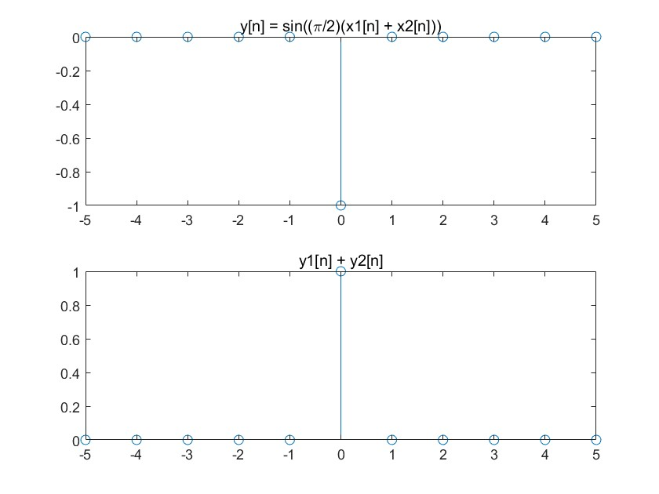
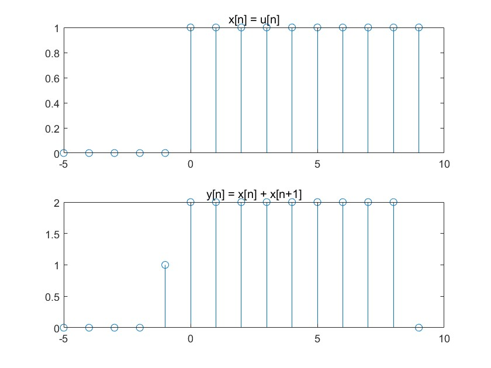
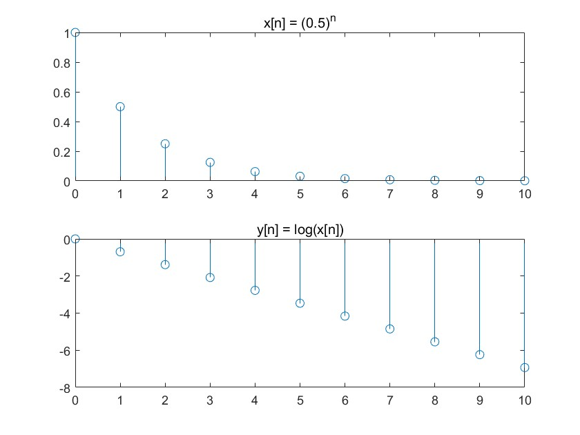
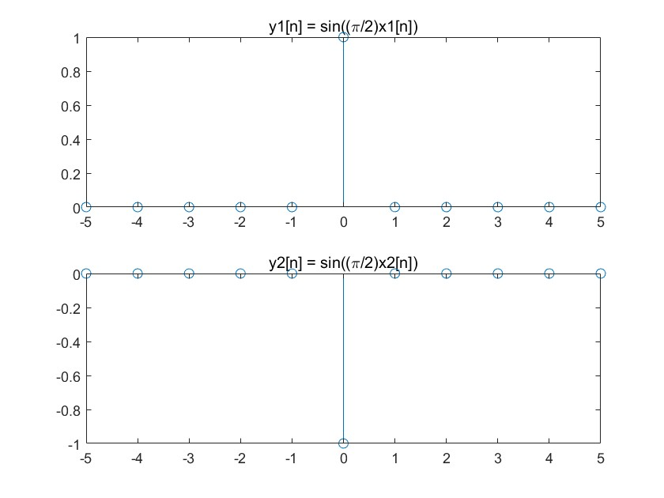
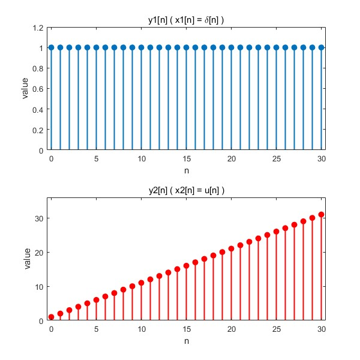
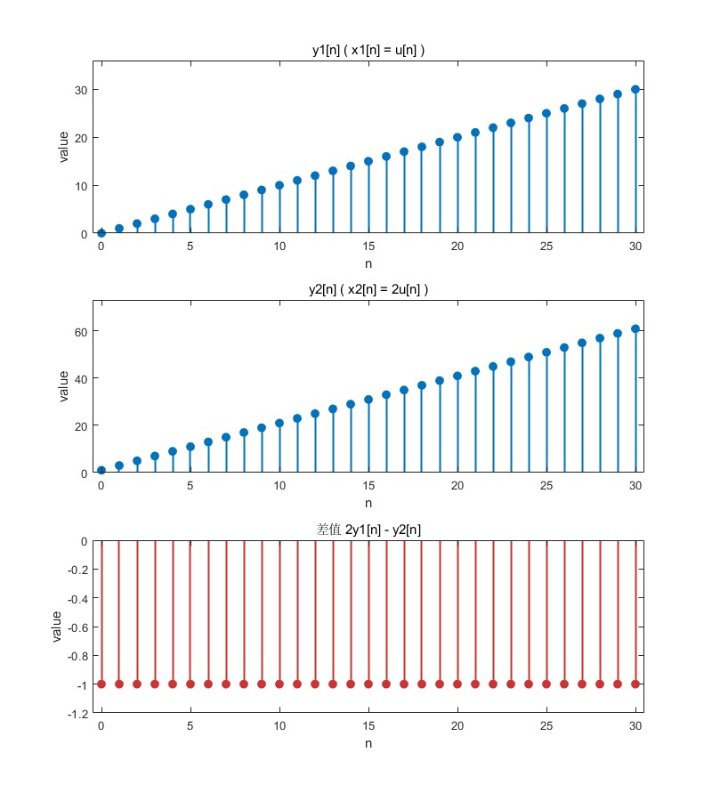
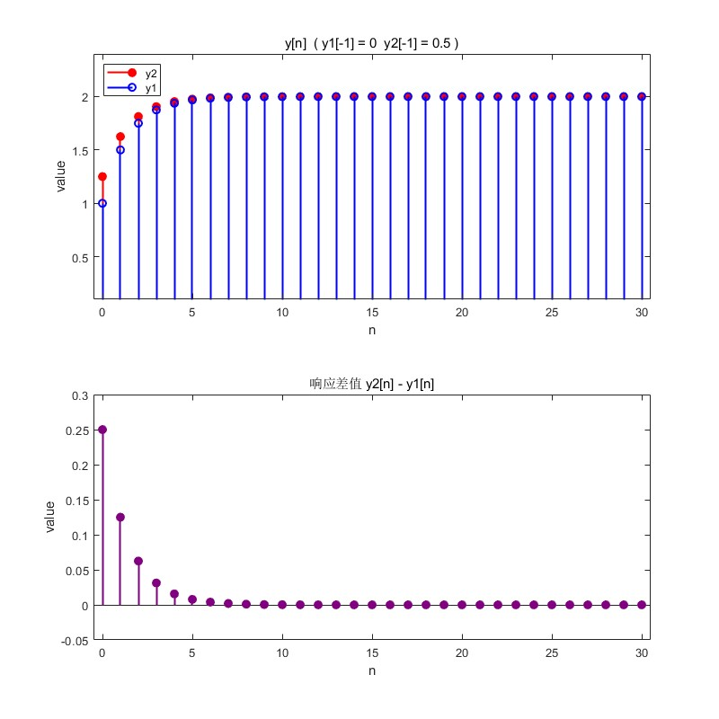

**LAB1**

---

**1.4a** 

**要求**

本题要求利用单位冲激函数证明系统 *y*[*n*] 违反线性特性。

**分析**

令 *x*3=*x*1+*x*2。为了判断系统的线性特性，我们将 *y*1+*y*2 与 *y*3 进行对比。根据线性系统的性质，如果一个系统是线性的，那么对于满足 *x*3=*x*1+*x*2 的输入，其对应的输出应满足 *y*3=*y*1+*y*2。

```matlab
n = -5:5;
x1 = [zeros(1,5), 1, zeros(1,5)]; % x1[n] = delta[n]
x2 = 2 * x1; % x2[n] = 2*delta[n]

y1 = sin((pi/2) * x1);
y2 = sin((pi/2) * x2);

% 检查线性性
y_sum = sin((pi/2) * (x1 + x2));
y1_plus_y2 = y1 + y2;

figure;
subplot(2,1,1);
stem(n, y_sum);
title('y[n] = sin((\pi/2)(x1[n] + x2[n]))');
subplot(2,1,2);
stem(n, y1_plus_y2);
title('y1[n] + y2[n]');
```



**结论**

由于y1+y2≠y3，故不满足线性。


---

**1.4b**

**要求**

用单位阶跃函数证明系统y[n]违反因果关系。

**分析**

因果系统要求输出*y*[*n*] 只依赖于当前和过去的输入，使用输入信号 *x[n]=u[n]*来验证因果性。

```matlab
n = -5:9;
x = [zeros(1,5), ones(1,10)]; % x[n] = u[n]

% 计算 y[n]
y = zeros(1, length(n));
for i = 1:length(n)-1
    y(i) = x(i) + x(i+1);
end

figure;
subplot(2,1,1);
stem(n, x);
title('x[n] = u[n]');
subplot(2,1,2);
stem(n, y);
title('y[n] = x[n] + x[n+1]');
```



**结论**

由于 y[n] 依赖于 x[n+1]，系统不是因果的


---

**1.4c**

**要求**

证明y[n] = log(x[n])是不稳定的。

**分析**

绘制信号图，证明当 x[n]→0，*x*[*n*] → 0 时 *y*[*n*] → −∞

```matlab
n = 0:10;
x = 0.5.^n; 

% 计算 y[n]
y = log(x);

figure;
subplot(2,1,1);
stem(n, x);
title('x[n] = (0.5)^n');
subplot(2,1,2);
stem(n, y);
title('y[n] = log(x[n])');
```



**结论**

当 x[n] 趋近于 0 时，y[n] 趋近于负无穷，系统不是稳定的


---

**1.4d**

**要求**

证明系统y[n]不可逆

**分析**

证明不同输入 *x*1[*n*] 和 *x*2[*n*] 产生相同输出 *y*1[*n*]=*y*2[*n*]，从而说明系统不可逆。

```matlab
n = -5:5;
x1 = [zeros(1,5), 1, zeros(1,5)]; % x1[n] = delta[n]
x2 = [zeros(1,5), -1, zeros(1,5)]; % x2[n] = -delta[n]

y1 = sin((pi/2) * x1);
y2 = sin((pi/2) * x2);

figure;
subplot(2,1,1);
stem(n, y1);
title('y1[n] = sin((\pi/2)x1[n])');
subplot(2,1,2);
stem(n, y2);
title('y2[n] = sin((\pi/2)x2[n])');
```



**结论**

由于 y1[n] 和 y2[n] 相同，系统不是可逆的


---

**1.5a** 

**要求**

题目要求编写MATLAB函数 `y = diffeqn(a, x, yn1)`,以实现递推方程：`y[n]=ay[n−1]+x[n]`

**分析**

通过递推法依次计算每个时刻的输出值`y[n]`。初始条件`y[−1]`用于计算第一个输出`y[0]`，后续值通过前一项输出与当前输入生成。输入信号`x[n]`的长度决定输出序列的范围 0≤*n*≤*N−1*。

```matlab
function y = diffeqn(a, x, yn1)

N = length(x);     % 输入信号x的长度N
y = zeros(1, N);   % 预分配y

% 计算生成 y[n]
y(1) = a * yn1 + x(1); 

for i = 2:N
    y(i) = a * y(i-1) + x(i); 
end
end
```

**结论**

函数正确实现了差分方程的递推计算，初始条件的影响被正确传递，确定了因果系统的输出`y[n]`。


---

**1.5b**

**要求**

分析系统`a=1`时单位冲激函数`δ[n]`和单位阶跃函数`u[n]`的响应特性，绘制响应曲线。

**分析**

冲激响应：输入`x1[n] = δ[n]`仅在`n=0`处为1，输出`y1[n]`对所有*n*≥0恒为1。

阶跃响应：输入`x2[n] = u[n]`持续为1，输出`y2[n]`表现为线性增长`y[n]=n+1`。

```matlab
a = 1;   
yn1 = 0; 
N = 31; 
n = 0:30; 

% 输入信号
x1 = zeros(1, N);    
x1(1) = 1;           % 初始化δ[n]

x2 = ones(1, N);     % 初始化u[n]

% 计算系统响应
y1 = diffeqn(a, x1, yn1); 
y2 = diffeqn(a, x2, yn1); 

% 绘制结果
figure;
grid on;

subplot(2,1,1);
stem(n, y1, 'filled', 'LineWidth', 1.5);
title('y1[n] ( x1[n] = \delta[n] )');xlabel('n');ylabel('value');
xlim([-0.5 30.5]);ylim([0 y1(N-1)*1.2]);

subplot(2,1,2);
stem(n, y2, 'filled', 'LineWidth', 1.5,'Color',[1,0,0]);
title('y2[n] ( x2[n] = u[n] )');xlabel('n');ylabel('value');
xlim([-0.5 30.5]);ylim([0 y2(N-1)*1.2]);
```



**结论**

系统在`a=1`时，冲激响应保持恒定，阶跃响应线性增长。


---

**1.5c**

**要求**

研究初始条件`y[−1]=−1`对系统线性性的影响，输入`x1[n] = u[n]`和`x2[n]=2u[n]`，分析`2y1[n]−y2[n]`的差值。

**分析**

`y[n] = -1+x[0]+x[1]+……+x[n]`，`x2[n] = 2x1[n]`。故 `2y1[n] – y2[n] = 2*(-1+x1[0]+x1[1]+……+x1[n])-(-1+x2[0]+x2[1]+……+x2[n]) = -1` 恒定。

```matlab
a = 1;
yn1 = -1;     
N = 31;  
n = 0:30;        

% 输入信号
x1 = ones(1, N);      % 初始化u[n]
x2 = 2 * ones(1, N);  % 初始化2u[n]

% 计算系统响应
y1 = diffeqn(a, x1, yn1); 
y2 = diffeqn(a, x2, yn1); 

difference = 2*y1 - y2;  

% 绘制结果
figure;
grid on;

subplot(3,1,1);
stem(n, y1, 'filled', 'LineWidth', 1.5);
title('y1[n] ( x1[n] = u[n] )');xlabel('n'); ylabel('value');
xlim([-0.5 30.5]); ylim([0,max(y1)*1.2]);

subplot(3,1,2);
stem(n, y2, 'filled', 'LineWidth', 1.5);
title('y2[n] ( x2[n] = 2u[n] )');xlabel('n'); ylabel('value');
xlim([-0.5 30.5]);ylim([0,max(y2)*1.2]);

subplot(3,1,3);
stem(n, difference, 'filled', 'LineWidth', 1.5, 'Color', [1 0 0]);
title('差值 2y1[n] - y2[n]');xlabel('n'); ylabel('value');
xlim([-0.5 30.5]);ylim([min(2.*y1-y2)*1.2,0]);
```



**结论**

`2y1[n] - y2[n]` 的差值恒为 -1，与图像相符。


---

**1.5d**

**要求**

研究系统参数`a=0.5`时，初始条件`y1[−1]=0`和`y2[−1]=0.5`对输出的影响差异。

**分析**

对于*|a|<1*，`y[-1]=0`和`y[-1]=0.5`，如果随着 n 增大，两个 `y[n]`的图像收敛于相同值，则可说明当 n 足够大时，`y[-1]`对`y[n]`的影响可以忽略不计。

```matlab
a = 0.5;
N = 31; 
n = 0:30; 
x = ones(1, N);		%初始化u[n]

% 初始y[-1]
yn1_case1 = 0;
yn1_case2 = 0.5;

% 计算系统响应
y1 = diffeqn(a, x, yn1_case1); 
y2 = diffeqn(a, x, yn1_case2);  

% 绘制结果
figure;
grid on;

subplot(2,1,1);
stem(n, y2, 'filled','LineWidth', 1.5,'Color', [1 0 0]);
hold on;
stem(n, y1,  'LineWidth', 1.5, 'Color', [0 0 1]);
title('y[n]  ( y1[-1] = 0  y2[-1] = 0.5 )');xlabel('n');ylabel('value');
xlim([-0.5 30.5]);ylim([0.1 max([y1(:);y2(:)])*1.2]);
legend('y2', 'y1','Location', 'northwest');
hold off;

subplot(2,1,2);
stem(n, y2-y1, 'filled', 'LineWidth', 1.5, 'Color', [0.5 0 0.5]);
title('响应差值 y2[n] - y1[n]');xlabel('n');ylabel('value');
xlim([-0.5 30.5]);ylim([-0.05 max(y2-y1)*1.2]);
```



**结论**

当∣*a*∣*<1*时，系统具有BIBO稳定性，随着 n 增大，两个`y[n]`的图像收敛于相同值，成功验证当n足够大时，`y[-1]`对 `y[n]`的影响可以忽略不计。

