**Lab2** 

---

**通过本实验掌握了：**

1.使用 **conv** 和 **filter** 函数实现离散信号的卷积与系统响应计算，直观验证了LTI系统的交换律、分配律等性质

2.设计回声消除系统，利用逆滤波（如 `filter(b,a,y)`）从含回声信号中还原原始信号

3.结合自相关函数估计未知回声参数（延迟N和衰减α），掌握遍历法与方程求解两种实用方法；

---

**2.4a**

**要求**

定义向量 x1、h1 和 h2，并创建对应的索引向量 nx1、nh1 和 nh2。使用 stem 函数绘制这三个信号的图形。

**分析**

因为要表示的函数离散且自变量较少，直接用矩阵表示函数，再用stem呈现

```matlab
x1 = [1, 1, 1, 1, 1, 0, 0, 0, 0, 0]; 
h1 = [1, -1, 3, 0, 1]; 
h2 = [0, 2, 5, 4, -1]; 
nx1 = 0:9; 
nh1 = 0:4;
figure;
stem(nx1, x1, 'b', 'LineWidth', 2);
title('x_1[n]');
xlabel('n');
ylabel('Amplitude');
grid on;

% Plot h1[n]
figure;
stem(nh1, h1, 'r', 'LineWidth', 2);
title('h_1[n]');
xlabel('n');
ylabel('Amplitude');
grid on;

% Plot h2[n]
figure;
stem(nh1, h2, 'g', 'LineWidth', 2);
title('h_2[n]');
xlabel('n');
ylabel('Amplitude');
grid on;
```

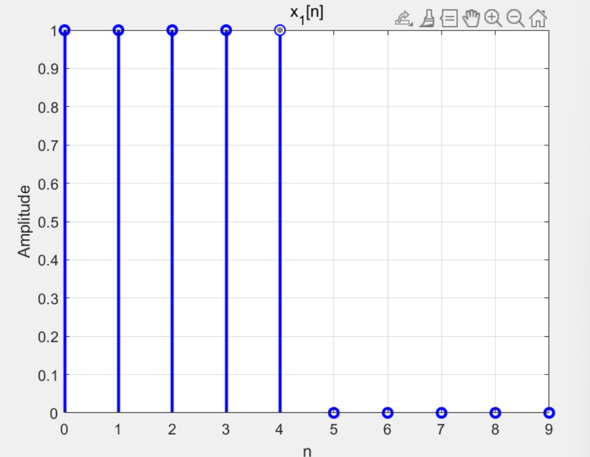

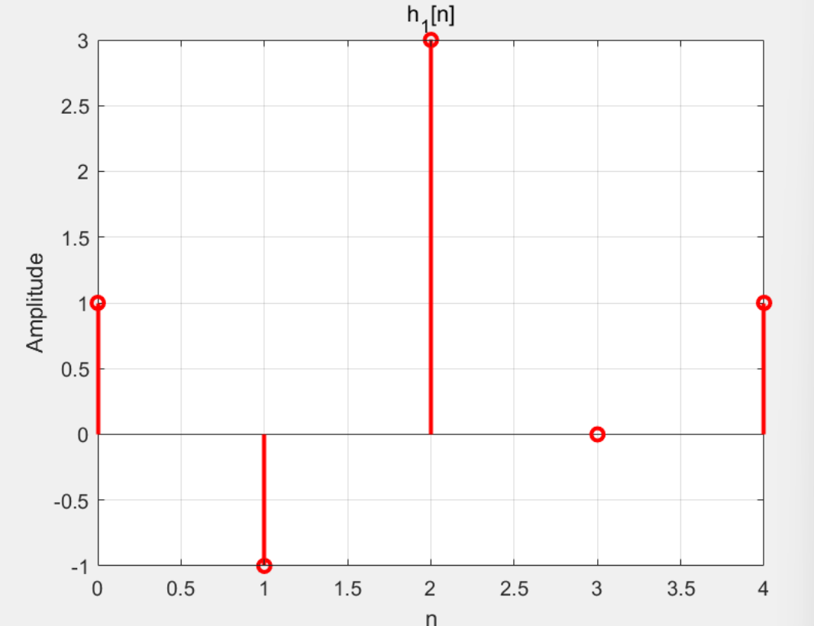

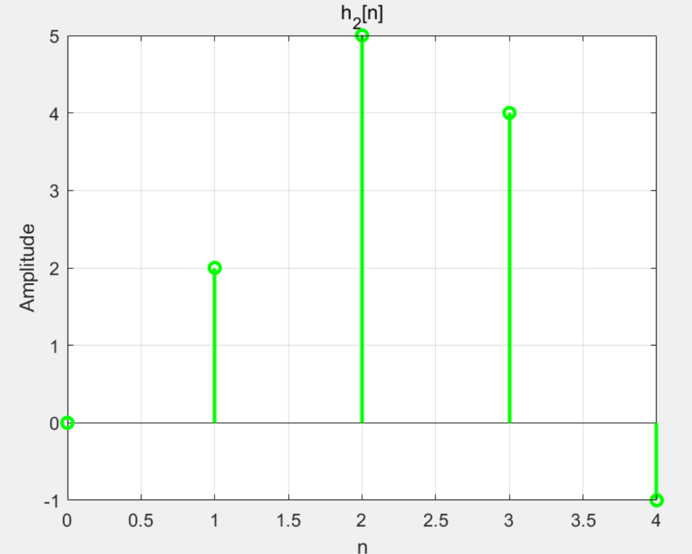

**结论**

如图所示

---

**2.4b**

**要求**

用 conv 函数对给定的 h1 和 x1 进行验证，并验证输入参数的顺序不同时conv 的输出是否相同。

**分析**

列出不同顺序相乘的卷积并直观用图像表示

```matlab
x1 = [1, 1, 1, 1, 1, 0, 0, 0, 0, 0]; 
h1 = [1, -1, 3, 0, 1]; 
y1=conv(x1,h1);
y2=conv(h1,x1);
nx = 0:length(x1)-1; 
nh = 0:length(h1)-1; 
ny = 0:length(y1)-1; 
figure;

subplot(4, 1, 1);
stem(nx, x1, 'b', 'LineWidth', 1.5);
title('Signal x[n]');
xlabel('n');
ylabel('Amplitude');
grid on;

subplot(4, 1, 2);
stem(nh, h1, 'r', 'LineWidth', 1.5);
title('Signal h[n]');
xlabel('n');
ylabel('Amplitude');
grid on;

subplot(4, 1, 3);
stem(ny, y1, 'g', 'LineWidth', 1.5);
title('Convolution y1[n] = x[n] * h[n]');
xlabel('n');
ylabel('Amplitude');
grid on;

subplot(4, 1, 4);
stem(ny, y2, 'filled', 'LineWidth', 1.5);
title('Convolution y2[n] = h[n] * x[n]');
xlabel('n');
ylabel('Amplitude');
grid on;
```

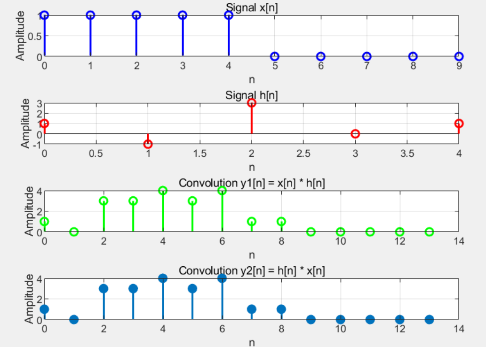

**结论**

卷积的结果与顺序无关，故成功验证了卷积的交换律。

---

**2.4c**

**要求**

使用给定的x1[n]、h1[n] 和 h2[n]，验证卷积运算的分配律。

**分析**

计算x[n] * (h1 [n] + h2[n])和x[n] * h1[n] + x[n] * h2[n]，随后用图像直观表示出来。

```matlab
x1 = [1, 1, 1, 1, 1, 0, 0, 0, 0, 0]; 
h1 = [1, -1, 3, 0, 1]; 
h2 = [0, 2, 5, 4, -1]; 
t1=h1+h2;
y1=conv(x1,t1);
y2=conv(x1,h1);
y3=conv(x1,h2);
y4=y2+y3;

nx = 0:length(y1)-1; 
nh = 0:length(y2)-1; 
ny = 0:length(y3)-1; 

figure;
subplot(2,1,1);
stem(nx,y1);
title('Signal,y1[n]=x[n] * (h1 [n] + h2[n])');
xlabel('n');
ylabel('Amplitude');
grid on;

subplot(2,1,2);
stem(nh,y4);
title('Signal,y4[n]= x[n] * h1[n] + x[n] * h2[n]');
xlabel('n');
ylabel('Amplitude');
grid on;
```

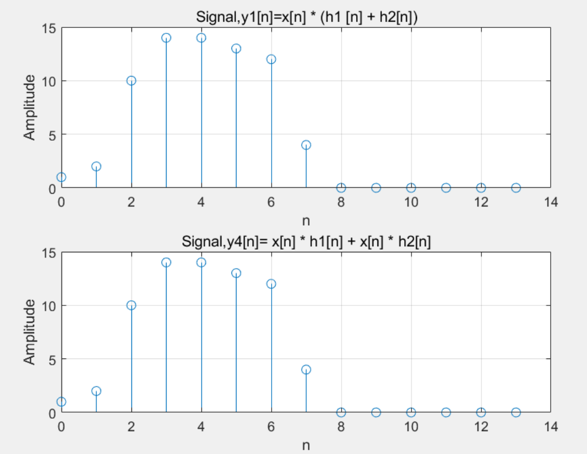

**结论**

由于前后两次运算的结果相同，故成功验证了卷积运算的分配律。

---

**2.4d**

**要求**

利用信号 x1[n], h1[n]和 h2[n]验证卷积运算的结合律。

**分析**

通过比较conv(w,h2)和conv(x1,hs)的结果来验证卷积的结合性。

```matlab
x1 = [1, 1, 1, 1, 1, 0, 0, 0, 0, 0]; 
h1 = [1, -1, 3, 0, 1]; 
h2 = [0, 2, 5, 4, -1]; 
w=conv(x1,h1);
yd1=conv(w,h2);
hs=conv(h1,h2);
yd2=conv(x1,hs);

nw = 0:length(w)-1; 
ny1= 0:length(yd1)-1; 
nh = 0:length(hs)-1; 
ny2 = 0:length(yd2)-1; 

figure;
subplot(2,1,1);
stem(ny1,yd1);
title('Signal,yd1[n]');
xlabel('n');
ylabel('Amplitude');
grid on;
subplot(2,1,2);
stem(ny2,yd2);
title('Signal,yd2[n]');
xlabel('n');
ylabel('Amplitude');
grid on;
```

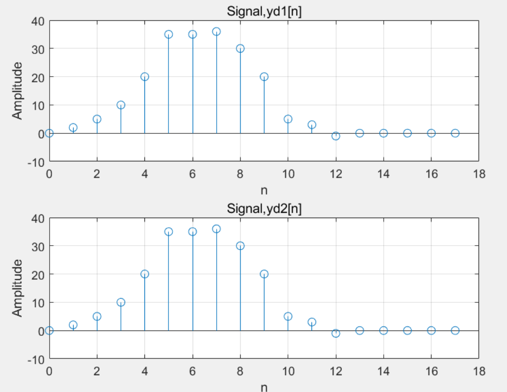

**结论**

由于前后两次运算的结果相同，故成功验证了卷积运算的结合律。

---

**2.4e**

**要求**

验证当LTI系统的冲激响应延迟*n*~0~ 时，其输出信号也会相应延迟*n*~0~。

**分析**

- 若系统冲激响应为*h*[*n*]，输入*x*[*n*] 的输出为*y*[*n*]=*x*[*n*]∗*h*[*n*]，则当冲激响应延迟为*h*[*n*−*n*~0~] 时，输出应满足*y*[*n*−*n*~0~]。
- 系统1的冲激响应为*h*1[*n*]。系统2的冲激响应为*h*1[*n*−2]。若时不变性成立，则*y*~e2~[*n*]=*y*~e1~[*n*−2]。

```matlab
x1 = [1, 1, 1, 1, 1]; 
he1 = [1, -1, 3, 0, 1];
he2 = [0,0,he1];

%计算卷积
ye1 = conv(x1, he1);
ye2 = conv(x1, he2);

%生成时间轴
nx1 = 0:4;
nhe1 = 0:4;
nhe2 = 0:6; 
nye1 = nx1(1)+nhe1(1):nx1(end)+nhe1(end); 
nye2 = nx1(1)+nhe2(1):nx1(end)+nhe2(end); 

% 绘制图片
figure;
subplot(2,1,1);
stem(nye1+2, ye1, 'b','filled', 'LineWidth', 2);
title('y_{e1}[n-2]');xlabel('n');ylabel('Value');xlim([0, max(nye2)+2]);
subplot(2,1,2);
stem(nye2, ye2, 'r', 'filled', 'LineWidth', 2);
title('y_{e2}[n]');xlabel('n');ylabel('Value');xlim([0, max(nye2)+2]);
```

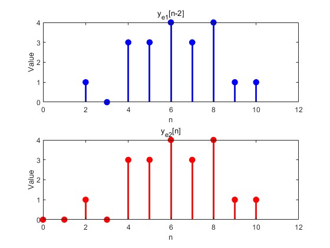

**结论**

MATLAB验证显示 *y*~e2~[*n*]=*y*~e1~[*n*−2]，LTI系统的时不变性成立，冲激响应延迟导致输出信号相同延迟。

---

**2.4f**

**要求**

验证时变系统与LTI系统级联时，卷积的结合律是否成立。

**分析**

- 对于LTI系统，(*x*∗*h*~1~)∗*h*~2~=*x*∗(*h*~1~∗*h*~2~)。
- 系统1为时变系统，其输出为*w*[*n*]=(*n*+1)*x*[*n*]。系统2为LTI系统，冲激响应为*h*1[*n*]。级联后的等效冲激响应为*h*~series~[*n*]=*h*~f1~[*n*]∗*h*~f2~[*n*]，但由于系统1的时变性，等效性被破坏。

```matlab
x1 = [1, 1, 1, 1, 1]; 
h1 = [1, -1, 3, 0, 1];

n = 0:4;
w = (n+1).*x1;		%计算w[n]
nw = 0:4;
nh1 = 0:4;

yf1 = conv(w,h1);		%计算yf1
nyf1 = nw(1)+nh1(1):nw(end)+nh1(end);

n = 0:4;
hf1 = [1,0,0,0,0];		%计算hf1
nhf1 = 0:4;

hseries = conv(hf1,h1);			%计算hseries
nhseries = nh1(1)+nhf1(1):nh1(end)+nhf1(end);

yf2 = conv(x1,hseries);			%计算yf2
nyf2 = n(1)+nhseries(1):n(end)+nhseries(end);

%绘制图片
figure;
subplot(2,1,1);
stem(nyf1,yf1,'b','filled','LineWidth',2);
xlabel('n');ylabel('Value');xlim([0 max([nyf1,nyf2])]);title('y_{f1}[n]');
subplot(2,1,2);
stem(nyf2,yf2,'r','filled','LineWidth',2);
xlabel('n');ylabel('Value');xlim([0 max([nyf1,nyf2])]);title('y_{f2}[n]');
```

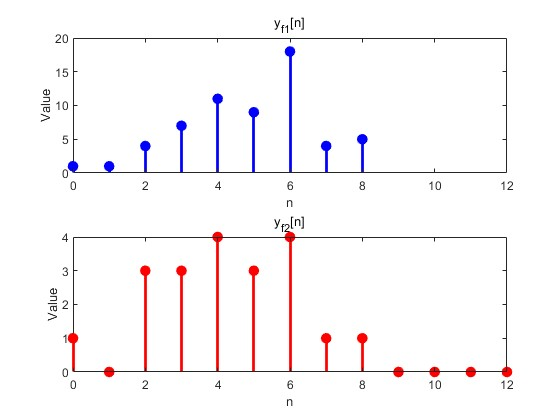

**结论**

MATLAB验证显示*y*~f1~[*n*]≠*y*~f2~[*n*]。时变系统破坏了卷积的结合律，等效冲激响应的假设不成立。结合律仅适用于LTI系统，时变系统级联需单独分析。

---

**2.4g**

**要求**

验证并联系统中非线性环节对卷积分配律的影响，通过比较直接并联输出（*y*~g1~[*n*]）与等效线性系统输出（*y*~g2~[*n*]）的差异。

**分析**

*y*~g1~[*n*] 的*n*=0 值由系统1的非线性平方操作直接放大，而 *y*~g2~[*n*] 的*n*=0 值由等效冲激响应的线性卷积产生。系统1的平方操作破坏了线性叠加性，导致并联系统的输出无法通过等效冲激响应完全表征。故无法通过这两个并联的系统进行卷积运算分配律的验证，即 *y*~g1~[*n*] ≠ *y*~g2~[*n*]。

```matlab
xg = [2, 0, 0, 0, 0];
h2 = [0, 2, 5, 4, -1];
nxg = 0:4;
nh2 = 0:4;

yga = xg .^ 2;
ygb = conv(xg, h2);
nygb = nxg(1)+nh2(1):nxg(end)+nh2(end);

yga_extended = [yga, zeros(1, length(ygb) - length(yga))]; % 补零
yg1 = yga_extended + ygb;
nyg1 = nygb;

hg1 = [1, 0, 0, 0, 0] .^ 2; 
h_parallel = hg1 + h2;

yg2 = conv(xg, h_parallel); 
nyg2 = nxg(1)+nh2(1):nxg(end)+nh2(end);

%绘制图片
figure;
subplot(2,1,1);
stem(nyg1, yg1, 'b', 'filled','LineWidth',2);
title('y_{g1}[n]');xlabel('n'); ylabel('Value');
subplot(2,1,2);
stem(nyg2, yg2, 'r', 'filled','LineWidth',2);
title('y_{g2}[n]');xlabel('n'); ylabel('Value');
```

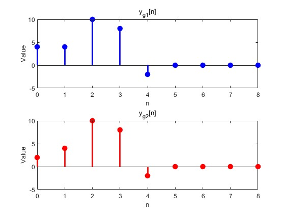

**结论**

根据绘图结果显示，y~g1~[n]≠y~g2~[n]。该现象与卷积分配律无关。系统1为非线性系统，其输出由输入平方直接产生，不涉及卷积运算；且非线性系统无冲激响应，故无法通过冲激响应叠加定义等效系统。分配律 *x*[*n*] ∗ (*h*1[*n*] + *h*2[*n*])=*x*[*n*] ∗ *h*1[*n*] + *x*[*n*] ∗ *h*2[*n*] 仅在所有系统均为LTI时成立，而系统1的非线性特性使其失效。

---

**2.10a**

**要求**

根据模型 *y*[*n*]=*x*[*n*]+*αx*[*n*−*N*]，推导并绘制回声系统的冲激响应 *h*e[*n*]。

**分析**

回声系统的差分方程表明，输出信号由原始信号和其延迟衰减版本叠加而成。其冲激响应直接由模型定义：*h*e[*n*]=*δ*[*n*]+*αδ*[*n*−*N*]。在 *n*=0 处赋值为 1，对应*δ*[*n*]。在 *n*=*N* 处赋值为 *α*，对应 *αδ*[*n*−*N*]。

```matlab
he = zeros(1, 1001); 
he(1) = 1;          % n=0
he(1001) = 0.5;     % n=1000, α=0.5
nhe = 0:1000;
stem(nhe, he, 'filled', 'LineWidth', 2);
xlabel("n");ylabel("Value");title("he[n]");
```

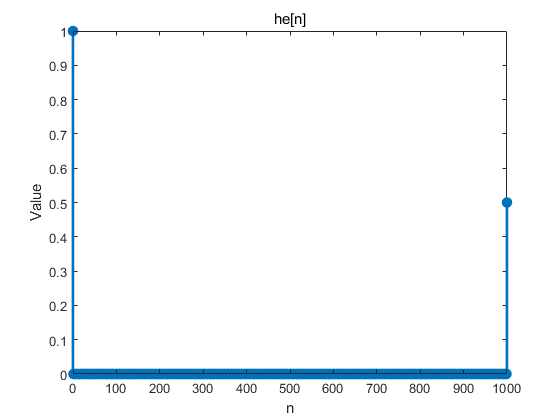

**结论**

冲激响应如图1所示，包含两个离散脉冲，分别位于 *n*=0 和 n*=*1000*，幅度为 1 和 0.5。

---

**2.10b**

**要求**

证明逆系统 *z*[*n*]+*αz*[*n*−*N*]=*y*[*n*] 能消除回声，验证 *z*[*n*]=*x*[*n*] 是有效解。

**分析**

将*y*[*n*] = *x*[*n*] + *αx*[*n*−*N*] 代入逆系统方程：*z*[*n*] + *αz*[*n*−*N*] = *x*[*n*]+  *αx*[*n*−*N*]。当*z*[*n*] = *x*[*n*] 时，方程成立。

---

**2.10c**

**要求**

计算逆系统的近似冲激响应 *her*[*n*]

**分析**

输入单位冲激信号 `d = [1 zeros(1,4000)]`。通过 `filter(1, a, d)` 计算截断响应，其中 `a = [1 zeros(1,N) alpha]`。

```matlab
d = [1 zeros(1, 4000)]; 
n0 = 0:4000;
her = filter(1, [1 zeros(1,999) 0.5], d);
stem(n0, her,"filled","LineWidth",2); 
xlabel("n");ylabel("Value");title('her[n]');
```

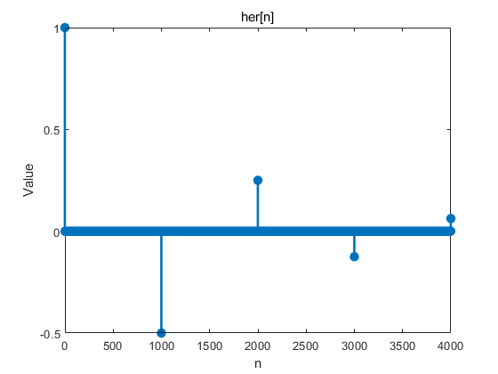

**结论**

系统的无限冲激响应的前 4001 位如图所示。

---

**2.10d**

**要求**

对比处理前后的语音信号波形，验证回声消除效果。

**分析**

实际语音信号 `y` 包含回声 α=0.5,N=1000*α*=0.5,*N*=1000，表现为周期性幅度波动。

```matlab
load lineup.mat;
ay = [1 zeros(1, 999) 0.5];
z = filter(1, ay, y);
n1 = 0:6999;

figure;
subplot(2,1,1);
plot(n1, y(1:7000));
title('y[n]');xlabel('n'); ylabel('Value');

subplot(2,1,2);
plot(n1, z(1:7000));
title('z[n]');xlabel('n'); ylabel('Value');
```


**结论**

经过回声消除系统滤波操作之后，周期性干扰消失，杂音明显被消除。

---

**2.10e**

**要求**

计算系统*h~oa~*[*n*]=*he*[*n*]∗*her*[*n*]并作图。

**分析**

按题目要求做出图像即可。

```matlab
he = [1 zeros(1, 999) 0.5]; 
d = [1 zeros(1, 4000)]; 
her = filter(1, [1 zeros(1,999) 0.5], d);
hoa = conv(he, her); 
n2 = 0:5000;

figure;
stem(n2, hoa, 'filled', 'LineWidth', 2);
title('h_{oa}[n]');
xlabel('n'); ylabel('Value');
```

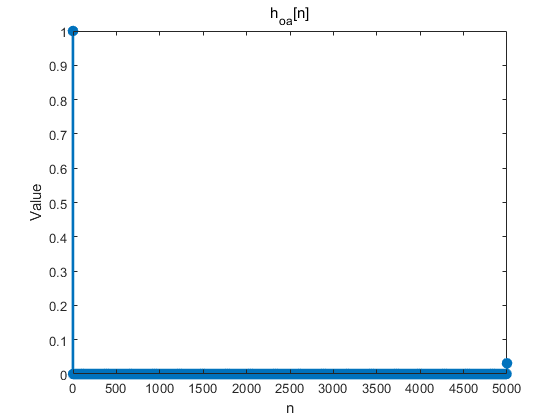

**结论**

实际响应在 *n*=0 处接近 1，但在 n=5000 处存在残留波动。其原因是 her 原为无限长响应，但在后续操作中被截断，导致最后一位的卷积结果发生了变化。

---

**2.10f**

**要求**

绘制自相关函数*Ryy*[*n*]，通过峰值估计y2的*N*,*α*和y3的*N*1,*α*1,*N*2,*α*2。

**分析**

*Ryy*[*n*]=*y*[*n*]∗*y*[−*n*] = x[n] ∗ x[−n] ∗ (𝛿[n] + α𝛿[n − N]) ∗ (𝛿[−n] + α𝛿[−n − N]) = (α^2^ + 1)Rxx[n] + αRxx[n − N] + αRxx[n + N]。

（lineup.mat中的y、y2、y3为列向量，故应该使用函数 flipud 而非 fliplr。）

```matlab
load lineup.mat; 
Ryy = conv(y, flipud(y)); 
n = -6999: 6999;

plot(n, Ryy);
title('R_{yy}[n]');xlabel('n'); ylabel('Value');
```

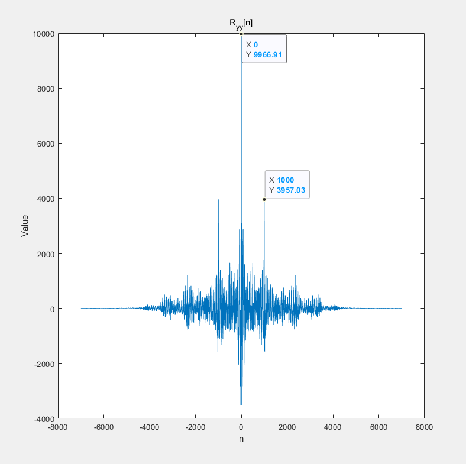

<center>图1</center>

```matlab
Ryy2 = conv(y2, flipud(y2));
plot(n,Ryy2);
title('R_{yy2}[n]');xlabel('n');ylabel("Value");
```

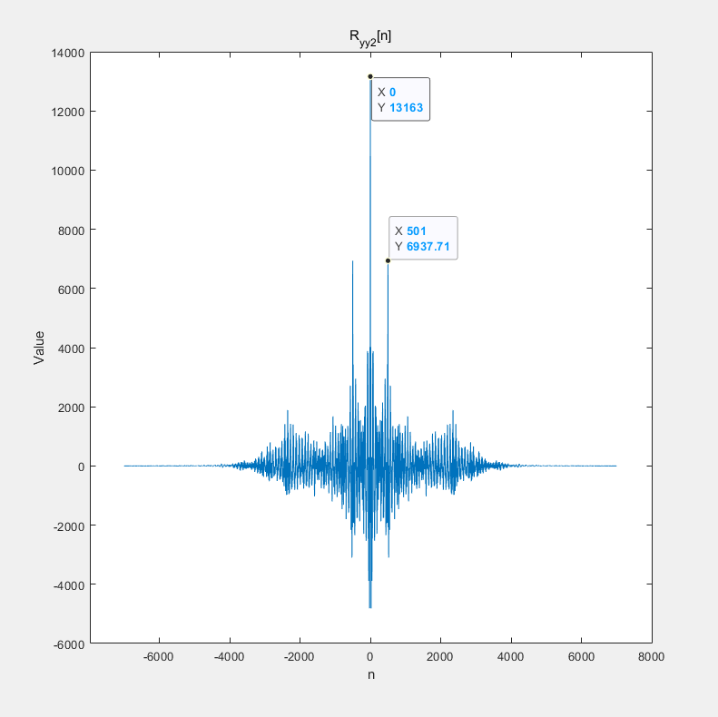

<center>图2</center>

```matlab
Ryy3 = conv(y3, flipud(y3));
plot(n,Ryy3);
title('R_{yy3}[n]');xlabel("n");ylabel("Value");
```

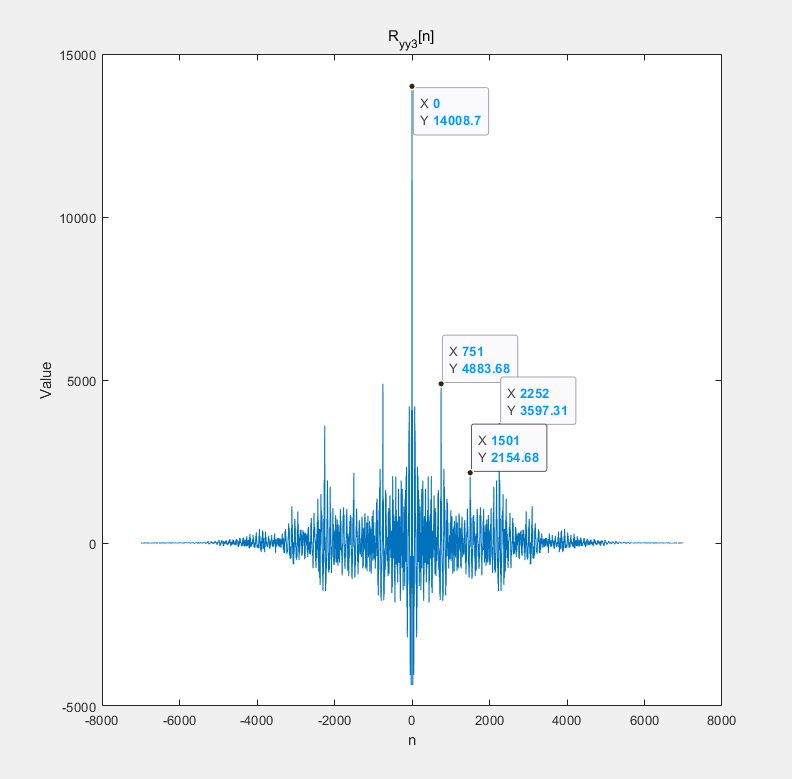

<center>图3</center>

**分析**

图像最高峰的值为(α^2^+1)Rxx[0]，次高峰值为αRxx[0]，最高峰和次高峰的间距为 N。

由图1可知y1 所对应的 N 为 1000，与已知相同。

由图2可知y2所对应的N为501，(α^2^+1)Rxx[0]/αRxx[0]=13163/6937.71,计算可得 α ≈ 0.949 ± 0.316i

由图3，7个峰点对应点 0、±N1、±（N2-N1）、±N2，故N1 = 751，N2 = 2252。

kα1 = 4883.68 ，kα2 = 3597.31 ，kα1α2 = 2154.68

计算可得α1 =0.599，α2 = 0.441
