**Lab 3 作业**  

学习收获：理解了其对周期与非周期信号的变换原理，掌握了线性、时移等性质及基本变换对。学会用 MATLAB 计算 CTFT，还了解了在 LTI 系统频率响应、冲激响应求解及调幅中的应用。


4.2

（a）

题目要求：求信号 *x*(*t*)=*e*−2∣*t*∣ 的连续时间傅里叶变换（CTFT）的解析表达式。

分析：将 *x*(*t*) 表示为 *x*(*t*)=*g*(*t*)+*g*(−*t*) 的形式，再应用傅里叶变换。

结论：X(j*w) = 1/(2+j*w) +1/(2-j*w)


（b）

题目要求：y(t) = x(t-5)，算出 y(t)的 CTFT 表达式，

分析：N = T/tau,此时的 N 为偶数，用 fft 方法；同时求出|Y(jw)|的值并作图

```matlab
dt = 0.01;          
T = 10;             
N = T/dt;           
t = 0:dt:T-dt;      
y = exp(-2*abs(t-5));
Y = dt * fft(y);
w = (-pi/dt) + (0:N-1)*(2*pi/(N*dt));
X_analytic = 4./(4 + w.^2);          
Y_analytic = X_analytic .* exp(-1j*5*w);
figure
subplot(2,1,1)
plot(t, y, 'b')
xlabel('时间 (s)')
ylabel('幅值')
title('时域信号 y(t) = e^{-2|t-5|}')
subplot(2,1,2)
plot(w, abs(Y_analytic), 'r')
xlabel('频率 (rad/s)') 
ylabel('幅度')
title('解析傅里叶变换幅度 |Y(jω)|')
xlim([-50 50])  
```

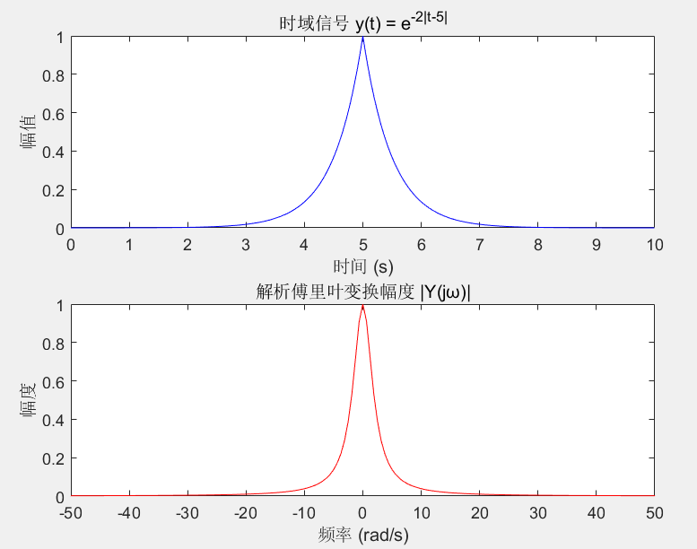

结论：如图所示

（c）

题目要求：用 fftshift 函数对 Y 进行变换

分析：使用fftshift函数

```matlab
Y = fftshift(tau*fft(y));
figure
plot(t,abs(Y))
title('Y 的幅值图')
ylabel('abs(Y)')
xlabel('ω')
```

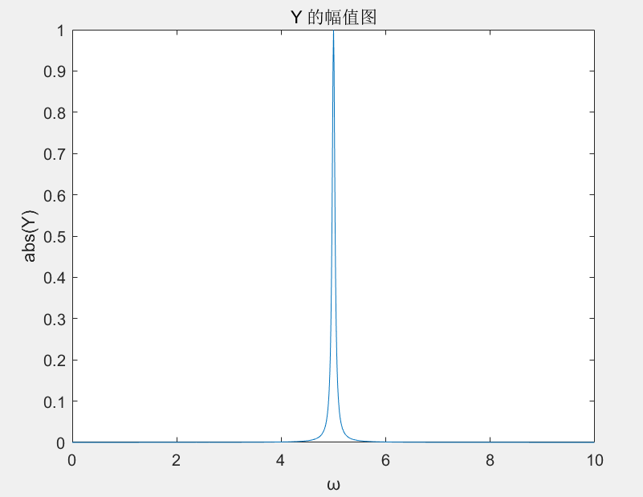

结论：如图所示


（d）

题目要求：确定w的范围

分析：应用偶数情况下的公式

```matlab
w = -pi/tau+(0:N-1)*2*pi/(N*tau);
```

结论:w =  -314.1593 -313.5309 -312.9026 -312.2743 -311.6460 -311.0177 -310.3894 -309.7610......


(e)

题目要求：由 Y 算出 X（在频域下算时间域）

分析：时移 5对应频域就要乘 exp(j*5*w)

```matlab
X = Y.*exp(1j*5*w);
plot(w,abs(X))
title('e 题中 X 的幅值')
ylabel('abs(X)')
xlabel('ω')

```

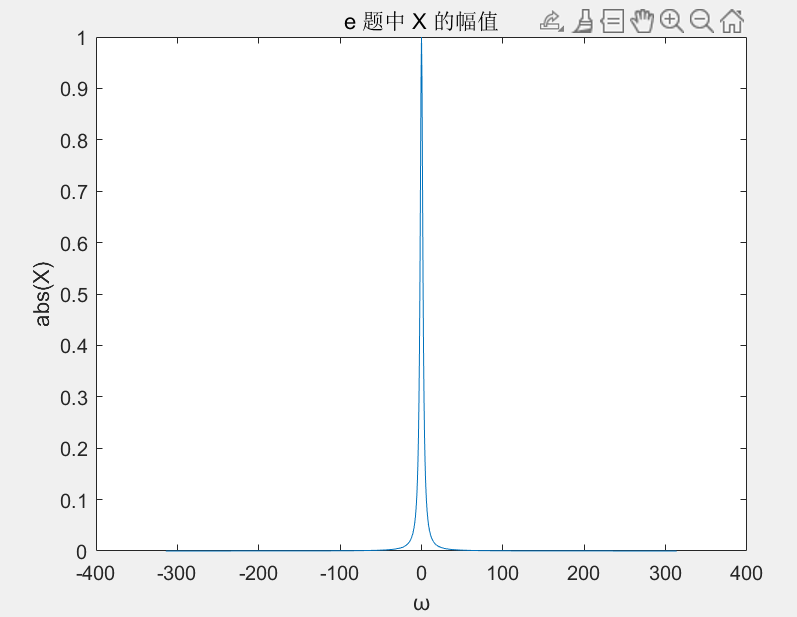

结论：如图所示

（f）

题目要求：画出 a 问中的 X(jw)和 e 问中的 X(jw)的幅值和角度图

分析：利用半对数图绘制信号的连续时间傅里叶变换（CTFT）的幅值和相角图，同时进行不同信号 CTFT 幅值的对比。

```matlab
figure
subplot(2,2,1)
plot(w,abs(X))
title('e 题中 X 的幅值')
ylabel('abs(X)')
xlabel('ω')

subplot(2,2,2)
plot(w,angle(X))
ylabel('angle(X)')
xlabel('ω')
title('e 题中 X 的相角')
X1 = 1./(2+1j*w)+1./(2-1j*w);

subplot(2,2,3)
plot(w,abs(X1))
title('a 题中 X 的幅值')
ylabel('abs(X)')
xlabel('ω')

subplot(2,2,4)
plot(w,angle(X1))
title('a 题中 X 的相角')
ylabel('angle(X)')
xlabel('ω')

figure
subplot(1,2,1)
plot(w,abs(X))
title('e 题中 X 的幅值')
ylabel('abs(X)-e')
xlabel('ω')
ylim([0.001,1])

subplot(1,2,2)
plot(w,abs(X1))
title('a 题中 X 的幅值')
ylabel('abs(X)-a')
xlabel('ω')
xlim([-20,20])
ylim([0.001,1])

figure
semilogy(abs(X),abs(X1))
ylabel('abs(X)-e/a')
xlabel('ω')
```

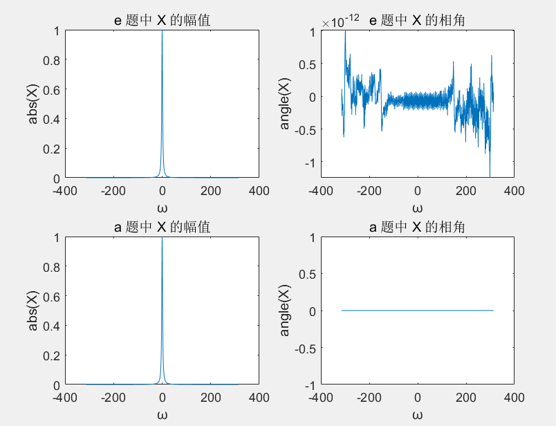

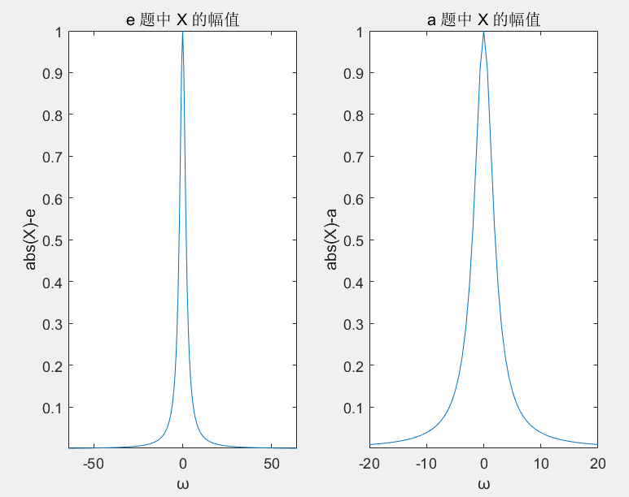

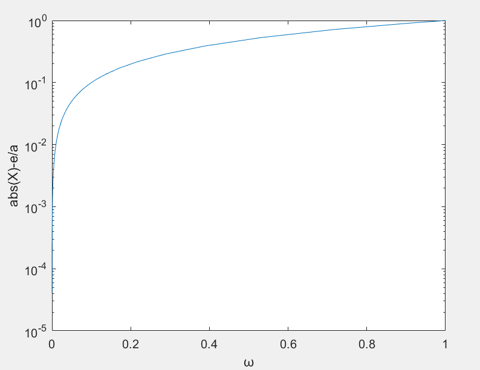

(g)

题目要求：画出 Y 的幅值图和相角图，与 X 比较 

分析：做出图像比较

```matlab
figure
subplot(2,2,1)
plot(w,abs(X))
title('X 的幅值')
ylabel('abs(X)')
xlabel('ω')
subplot(2,2,2)
plot(w,angle(X))
ylabel('angle(X)')
xlabel('ω')
title('X 的相角')
subplot(2,2,3)
plot(w,abs(Y))
title('Y 的幅值图')
subplot(2,2,4)
plot(w,angle(Y))
title('Y 的相角图')

```

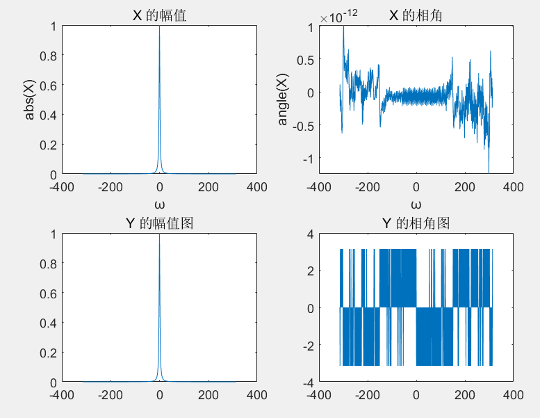

结论：时域信号时移所对应的频域信号幅值不变，只有相角变化


**4.6a**

**要求**

通过使用摩尔斯码的 `dot` 和 `dash` 信号，构建并绘制字母 "Z" 的摩尔斯码信号。

**分析**

按照题目要求导入 mod 文件，并按题目要求操作即可。

```matlab
load('ctftmod.mat');
%a
z_signal = [dash, dash, dot, dot]; 

figure;
plot(t(1:length(z_signal)), z_signal);
xlabel('t');ylabel('z(t)');title('Z 的摩尔码');
```

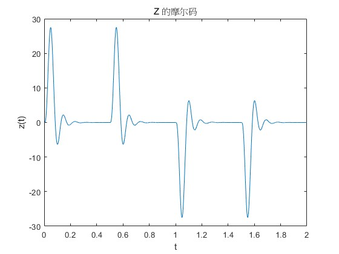

#### **结论**：

成功构造了字母 Z 的摩尔斯码信号，并通过绘图显示了它的时域波形。这个信号展示了在摩尔码中如何表示字母 Z。

---

**4.6b**

**要求**

绘制低通滤波器的频率响应

**分析**

通过使用 `freqs` 函数绘制低通滤波器的频率响应

```matlab
%b
figure;
freqs(bf, af); 
xlabel('频率 (Hz)');
ylabel('增益');
title('低通滤波器的频率响应');
```

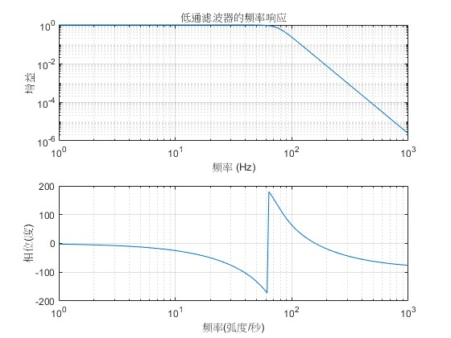

**结论**

画出图像如图所示

---

**4.6c**

**要求**

使用低通滤波器对 `dot` 和 `dash` 信号进行滤波，并观察其频率响应变化。

**分析**

通过 `lsim` 函数对这两个信号进行滤波，并绘制滤波前后信号的比较图。

```matlab
%c
y_dash = lsim(bf, af, dash, t(1:length(dash)));
y_dot = lsim(bf, af, dot, t(1:length(dot)));

figure;
subplot(2, 1, 1);
plot(t(1:length(dash)), dash);
hold on;
plot(t(1:length(y_dash)), y_dash, '--');
title('dash信号与滤波后的dash信号');
legend('原始dash', '滤波后的dash');

subplot(2, 1, 2);
plot(t(1:length(dot)), dot);
hold on;
plot(t(1:length(y_dot)), y_dot, '--');
title('dot信号与滤波后的dot信号');
legend('原始dot', '滤波后的dot');
```


**结论**

两个信号波形基本没变，能量损失很小，只是发生了相位变化。这表明低通滤波器对低频信号有很好的保持作用。

---

**4.6d**

**要求**

通过将 `dash` 信号与调制信号 `cos(2πf1t)` 相乘，调制原始信号并观察调制效果。

**分析**

调制后的信号会包含原始信号频率的副本，同时频率上移。调制后信号的频谱应呈现出在原始信号的两倍频率附近的频率成分。

```matlab
%d
y_mod = dash .* cos(2*pi*f1*t(1:length(dash)));

figure;
plot(t(1:length(dash)), y_mod);
xlabel('时间 t');
ylabel('调制后的信号');
title('调制后的dash信号');

y_filtered = lsim(bf, af, y_mod, t(1:length(dash)));

figure;
plot(t(1:length(dash)), y_filtered);
xlabel('时间 t');
ylabel('滤波后的信号');
title('滤波后的调制信号');
```

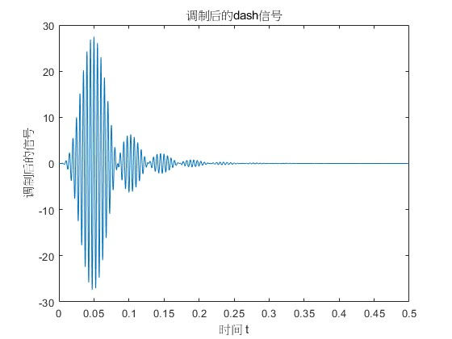


**结论**

调制信号将 `dash` 信号的频率上移，但信号所含能量基本完全损失。

---

**4.6e**

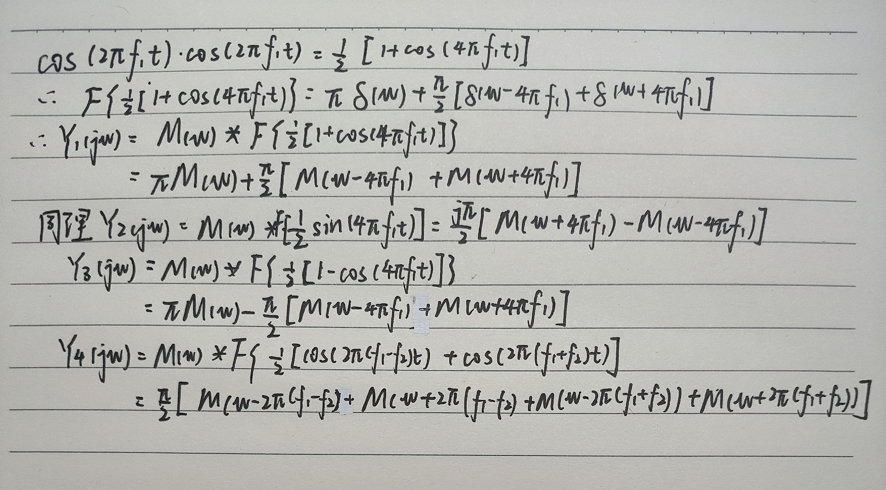

---

**4.6f**

**要求**

从混合信号 `x(t)` 中提取出单独的信号 `m1(t)`，并通过分析频率响应来解码信号。

**分析**

通过低通滤波器的频率响应，分析混合信号 `x(t)` 的频率特性，并使用滤波器提取出 `m1(t)`。然后绘制提取后的信号并判断对应的摩尔码字母。

```matlab
%f
m1t = x.*cos(2*pi*f1*t);
m1 = 2*lsim(bf,af,m1t,t);
figure 
plot(t,m1);
xlabel('t')
ylabel('m1')
grid on
legend('m1')
```

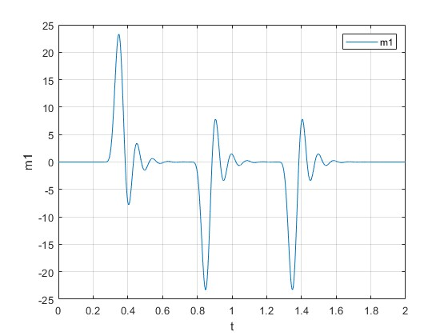

**结论**

由摩尔码表可知该信号代表D

---

**4.6g**

**要求**

```matlab
%g
m2t = x.*sin(2*pi*f2*t);
m2 = 2*lsim(bf,af,m2t,t);
figure 
subplot(2,1,1)
plot(t,m2,'r');
xlabel('t')
ylabel('m2')
legend('m2')
m3t = x.*sin(2*pi*f1*t);
m3 = 2*lsim(bf,af,m3t,t);
subplot(2,1,2)
plot(t,m3);
xlabel('t')
ylabel('m3')
legend('m3')
```

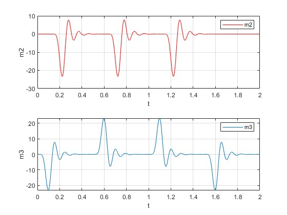

**结论**

成功提取了 `m2(t)` 和 `m3(t)` 信号，并分别解码出它们对应的字母为S和P。通过这些信号的分析，完成了对整个摩尔斯码消息的解码。

Agent007的消息是"The future of technology lies in DSP"。


