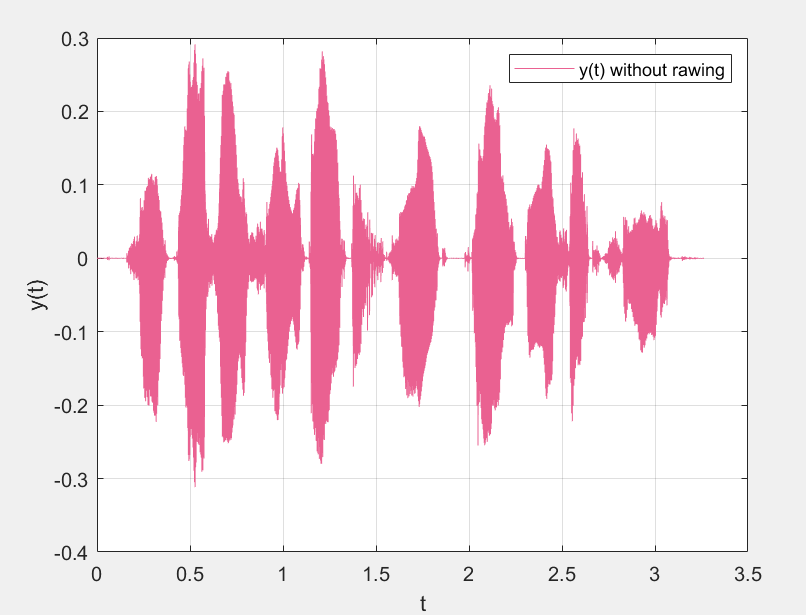
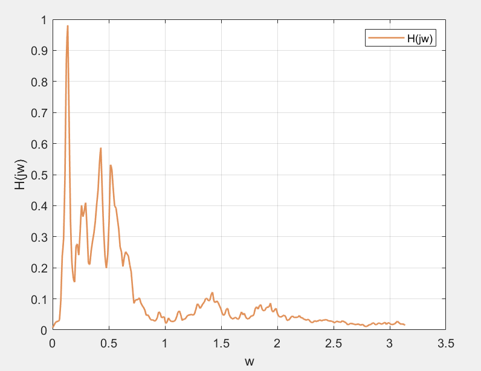
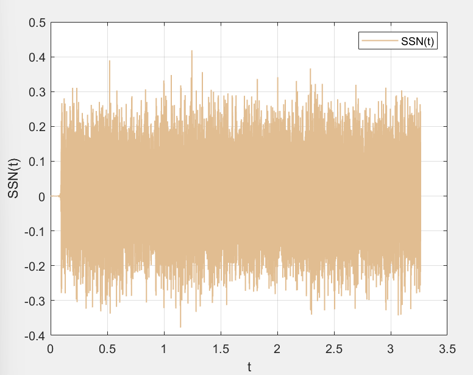
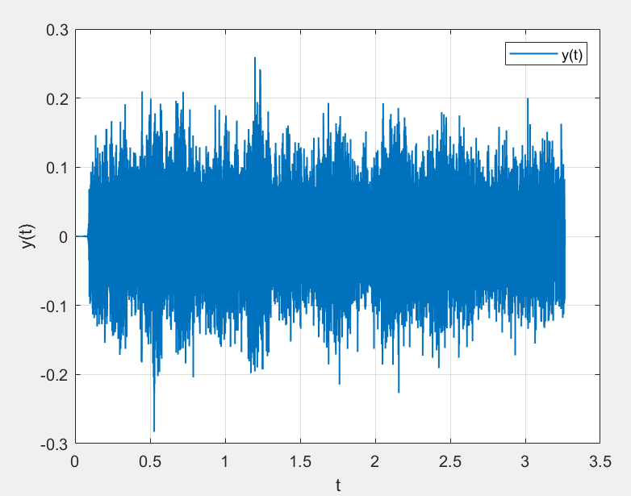
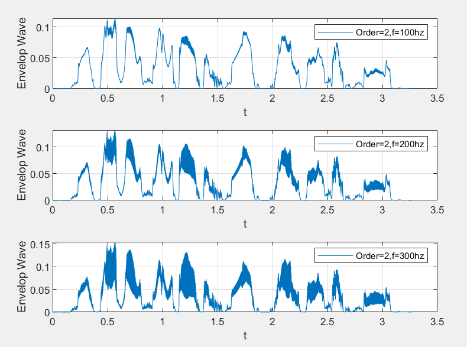
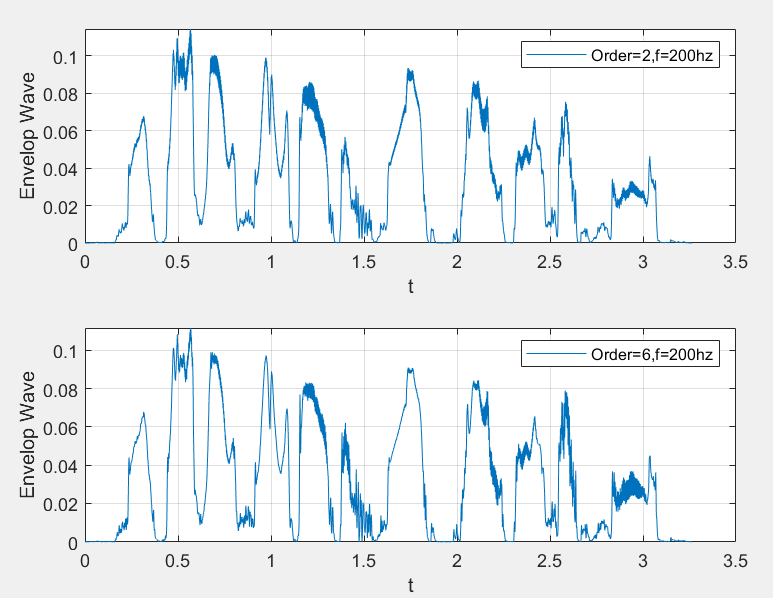

**Lab5**

学习收获：深入理解了巴特沃斯和 FIR 滤波器的设计与应用。学会利用 Matlab 设计不同类型滤波器，掌握生成语谱噪声、提取信号包络及调整信号强度的方法。同时，对信噪比概念和音频文件处理操作也有了清晰认识，提升了信号处理实践能力。

1.

题目要求：给定一个已有的语音信号，

1. 依据该语音信号生成语谱噪声。
2. 绘制源语音信号的相关图像。
3. 绘制频率响应的图像。
4. 绘制语谱噪声的频谱图像。

分析：

1. 从 BB 平台导入自带的 `C_01_01(1).wav` 语音声源。

2. 利用已导入的语音声源生成语谱滤波器。

3. 自行构建一段白噪声信号。

4. 将构建好的白噪声信号通过前面生成的语谱滤波器进行滤波处理，滤波后的信号即为语谱噪声。

   ```matlab
   % 清空命令窗口和工作区
   clc;
   clear;
   
   % 读取音频文件
   [x, fs] = audioread('C_01_01(1).wav');
   x = x';
   t = linspace(0, length(x)/fs, length(x));
   
   % 绘制原始音频信号
   figure;
   plot(t, x, 'Color', [234, 97, 145]/255);
   xlabel('t');
   ylabel('y(t)');
   grid on;
   legend('y(t) without rawing');
   
   % 功率谱估计与滤波器设计
   y10 = repmat(x, 1, 10);
   nfft = 512;
   noverlap = nfft/2;
   window = hamming(nfft);
   [P, w] = pwelch(y10, window, noverlap, nfft, fs);
   b = fir2(3000, w/(fs/2), sqrt(P/max(P)));
   [H, W] = freqz(b, 1);
   
   figure;
   plot(W, abs(H), 'LineWidth', 1.3, 'Color', [225, 145, 89]/255);
   xlabel('w');
   ylabel('H(jw)');
   grid on;
   legend('H(jw)');
   
   % 生成带限噪声信号
   N = length(x);
   noise = 1 - 2 * rand(1, N);
   SSN = filter(b, 1, noise);
   
   figure;
   plot(t, SSN, 'LineWidth', 1.0, 'Color', [225, 189, 145]/255);
   xlabel('t');
   ylabel('SSN(t)');
   grid on;
   legend('SSN(t)');
   ```

   





结论：如图所示

2.

题目要求：

1. 设定信噪比（SNR）为 -5 分贝。
2. 在原始语音信号里添加之前生成的语谱噪声，以此生成带有噪声的信号。
3. 对带噪声的信号 *y* 进行标准化操作，使得其能量相对于原始语音信号 *x*(*t*) 的能量保持一致。

分析：

1. **计算语谱噪声能量调整系数**
   已知信噪比 *SNR*=−5 分贝，根据公式 *SNR*=20×lg(norm(*x*)/norm(*SSN*))，可推导出 norm(*SSN*)=norm(*x*)×10^(1/4)。依据此式来调整语谱噪声的能量。
2. **验证信噪比**
   在调整语谱噪声能量后，再次使用 *SNR*=20×lg(norm(*x*)/norm(*SSN*)) 公式来验证信噪比是否符合 -5 分贝的设定。
3. **生成带噪信号**
   把调整好能量的语谱噪声添加到原始语音信号中，从而生成带有噪声的信号。
4. **调整带噪信号能量**
   对生成的带噪声信号进行能量调整，使调整后的带噪信号能量与原始语音信号的能量相同。

```matlab
% 调整噪声幅度并与原始信号叠加
SSNf = SSN/norm(SSN)*norm(x)*(10^0.25);
SNR = 20*log10(norm(x)/norm(SSNf));
y0 = x + SSNf;
y = y0/norm(y0)*norm(x);

figure;
plot(t, y, 'LineWidth', 1.0);
xlabel('t');
ylabel('y(t)');
grid on;
legend('y(t)');
```



结论：噪音如图所示


3.

题目要求：

1. 分别使用二阶且截止频率为 100Hz、200Hz、300Hz 的巴特沃斯低通滤波器，以及六阶且截止频率为 200Hz 的巴特沃斯低通滤波器对原始信号进行处理。
2. 通过上述滤波器处理得到原始信号对应的包络。
3. 对不同滤波器处理后得到的包络进行对比，分析它们之间的差异。

分析：按照题目所示阶数和截止频率分别构造巴特沃斯滤波器

```matlab
% 设计巴特沃斯滤波器并绘制包络波形
[b1, a1] = butter(2, 100/(0.5*fs));
[b2, a2] = butter(2, 200/(0.5*fs));
[b3, a3] = butter(2, 300/(0.5*fs));
[b4, a4] = butter(6, 200/(0.5*fs));

yb1 = filter(b1, a1, abs(x));
yb2 = filter(b2, a2, abs(x));
yb3 = filter(b3, a3, abs(x));
yb4 = filter(b4, a4, abs(x));

figure;
subplot(3, 1, 1);
plot(t, yb1);
xlabel('t');
ylabel('Envelop Wave');
grid on;
legend('Order=2,f=100hz');

subplot(3, 1, 2);
plot(t, yb2);
xlabel('t');
ylabel('Envelop Wave');
grid on;
legend('Order=2,f=200hz');

subplot(3, 1, 3);
plot(t, yb3);
xlabel('t');
ylabel('Envelop Wave');
grid on;
legend('Order=2,f=300hz');

figure;
subplot(2, 1, 1);
plot(t, yb1);
xlabel('t');
ylabel('Envelop Wave');
grid on;
legend('Order=2,f=200hz');

subplot(2, 1, 2);
plot(t, yb4);
xlabel('t');
ylabel('Envelop Wave');
grid on;
legend('Order=6,f=200hz');
```





结论： 

1. 在滤波器阶数相等的情况下，如果截止频率存在差异，那么截止频率较高的滤波器能够保留更多的高频信号，进而降低失真程度。 

2. 当滤波器的截止频率保持一致时，若阶数不一样，阶数较高的滤波器所实现的滤波效果会更佳，并且在获取包络时能使其更加完整。   


4.题目要求： 保存为.wav 文件

```matlab
% 保存叠加后的信号为音频文件
audiowrite('new_signal.wav', y0, fs);
```

结论：经处理后所保存的音频中存在较为明显的杂音，不过音频原来的内容依旧能够清晰地听清楚。
