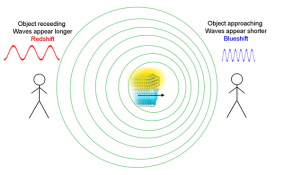
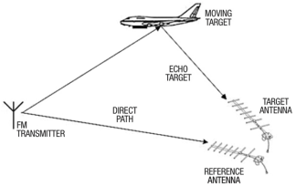
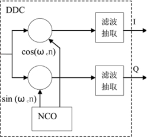
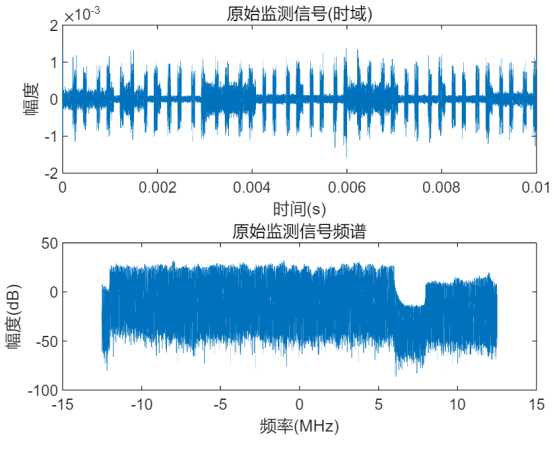
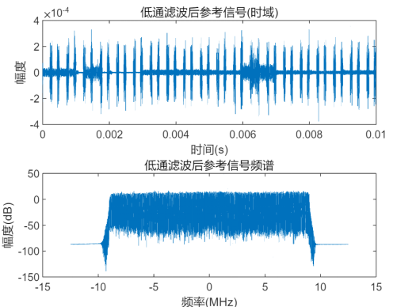
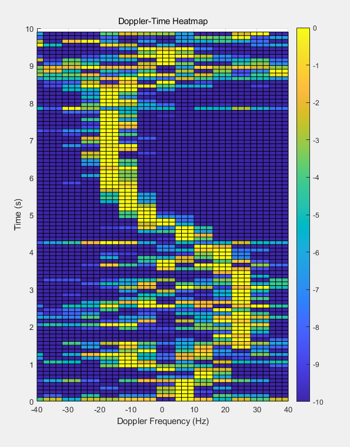

# Report of Project2：Motion detection via communication signals

## 项目背景和原理

### 项目背景

#### 多普勒频移



多普勒频移指的是当信号源和观测器相对运动时，反射回来的信号的频率会发生改变。当信号源接近时接收频率增加(称为 “蓝移”)，而离开时减少(称为“红移”)。可由以下公式计算接收频率：
$$
f' = (\frac{v±v_0}{v∓v_s})f
$$
其中：

$$f'$$为接受到的频率，$$f$$ 为信号源的原始发射频率；

$$v $$ 为波在该介质中的行进速度；

$$v_0$$ 为观测器相对介质的移动速度,接近信号源则运算符号为+号，反之为−号；

$$v_s$$ 为信号源相对介质的移动速度,接近观测器则运算符号为−号，反之为+号。

#### 无源雷达

无源雷达是一种不发射电磁波的雷达系统。它主要依靠接收外部源（如广播电台、电视塔、通信基站等）发射的信号，这些信号在遇到目标（如飞机、车辆等）后会发生反射，从而使无源雷达能够探测和跟踪目标。



无源雷达接受外部源直接传来的信号和经运动物体反射过来的信号，通过处理和分析这两种信号，能够得到运动物体的位置和速度。

---

### 项目原理

#### 数字下变频



数字下变频主要是利用数字信号处理技术，将接收到的高频数字信号通过一系列的处理过程，转换为低频的数字信号，以便后续进行更方便的处理和分析。其核心是基于数字混频和数字滤波等操作，将信号的频率从较高的载波频率下变频到较低的中频或基带频率。

步骤：

a、 数字混频：将高频的数字信号与一个本地产生的数字本振信号进行混频，使信号的频率从较高的载波频率下变频到较低的中频或基带频率。

b、 低通滤波：去除混频过程中产生的高频镜像信号和其他不需要的频率成分，保留所需的低频信号。

c、 抽取：在低通滤波后，信号的频率已经降低到较低的范围，此时可以对信号进行抽取操作，通过每隔一定数量的样点丢弃一些样点来降低采样率。

#### 模糊函数

模糊函数是信号与其自身的时间延迟和频率偏移的自相关函数，可用下式表示：
$$
\begin{align*}
\text{Cor}(c, d) &= \int_{t}^{t+T} y_{\text{sur}}(t + c) \left[ y_{\text{ref}}(t) e^{j 2\pi d t} \right]^* \\
&= \int_{t}^{t+T} y_{\text{sur}}(t + c) y_{\text{ref}}^*(t) e^{-j 2\pi d t}
\end{align*}
$$
在本项目中：

$$c$$ 表示时间延迟；$$y_{sur}$$ 表示检测信号；$$y_{ref}$$ 表示参考信号；$$d$$ 表示多普勒频移。

模糊函数描述了信号在时间和频率两个维度上的自相关特性。通过分析模糊函数，可以评估雷达系统在距离（时间延迟）和速度（多普勒频率）两个维度上的分辨率和性能。

---

## Task 1

### 实验目的

本任务旨在对接收到的参考信号和监视信号进行预处理操作，包括数字下变频（DDC）与低通滤波（LPF），从而提取出目标频段内的有效基带信号。

---

### 实验方法与参数设置

#### 数据处理范围与采样率

- 数据文件编号：`data_1.mat` 至 `data_20.mat`
- 每个文件包含 0.5 秒长的复数雷达接收信号；
- 采样率：fs = 25e6（25 MHz）

#### 数字下变频（DDC）

接收信号中包含两个频段：2110–2130 MHz（主信号）和 2130–2135 MHz（干扰信号）。为了聚焦主信号并压制高频干扰，使用如下 DDC 参数：

- 中心搬移频率设定为 `f_ddc = -3e6`，将 2110~2130 MHz 搬移至基带（−10 MHz ~ +10 MHz）；
- 实现方式为将信号与本地振荡器进行复数调制（`exp(-j2πf_ddc·t)`）；




上图展示了原始参考信号与监视信号在时域与频域下的表现。


上图展示了参考信号与监视信号在 DDC 处理后的频谱对齐效果，可见频谱成功搬移至 0 Hz 附近。

#### 低通滤波器设计

为了进一步滤除频谱中高于 ±9 MHz 的干扰部分，设计了如下低通滤波器：

- 类型：Butterworth IIR 滤波器；
- 阶数：20 阶；
- 截止频率：9 MHz；
- 实现方式：使用 `filtfilt` 双向滤波，保证零相位响应，避免信号失真。




上图 展示了低通滤波器作用后的信号表现，高频成分被有效抑制，保留了主频段能量。

#### 函数结构与处理流程

我们定义了三个不同的处理函数：

- `refer(seq_ref, fs, f_ddc)`：用于处理参考信号并绘制图像；
- `surf(seq_sur, fs, f_ddc)`：用于处理监视信号并绘制图像；
- `transf(seq, fs, f_ddc)`：用于其余批处理数据，不绘图，仅返回结果。

以上函数输出两个变量：

- `seq_out_t`：处理后的时域信号（滤波后）；
- `seq_out_w`：对应的频域幅度谱（单位 dB），用于频谱分析。

我们对 20 个数据文件依次调用上述函数，生成了处理结果 `seq_ref_out_t_1` ~ `seq_ref_out_t_20` 与 `seq_sur_out_t_1` ~ `seq_sur_out_t_20`，并保存在工作区，供后续模糊函数与多普勒处理调用。

---

### 结果分析

在原始信号中，频谱主要分布于 2110–2135 MHz，其中 2130–2135 MHz 是高频基站干扰部分，不属于我们关注目标。

通过设置 `f_ddc = -3e6`，DDC 将 2110–2130 MHz 主信号频段搬移至以 0 Hz 为中心的基带区域，从图中可见频谱中心实现了精确对齐。

随后使用 20 阶 Butterworth 滤波器，并通过零相位的 `filtfilt` 处理，成功滤除了 ±9 MHz 以外的干扰成分。滤波后的频谱集中、能量主峰突出，有效提高了后续处理信号的质量。

整个流程确保了频率搬移与滤波的准确性，使后续模糊函数计算与目标轨迹提取能够在干净、稳定的信号上进行。

---

## Task 2

### 实验目的

本任务旨在利用 Task 1 中低通滤波后的参考与监视信号，构建多个时间段的 **距离-多普勒（Range-Doppler）谱图**，以展现特定时间窗口内目标的瞬时运动状态。

------

### 实验方法与参数设置

#### 时延与多普勒频率配置

- **采样率** `fs = 25e6`：用于将样本单位的时延转换为实际距离；
- **光速** `c = 3e8`：用于计算目标距离；
- **时延点数组** `tau_array = 0:1:6`：共 7 个点，对应约 0~72 米的距离；
- **多普勒频移数组** `fd_array = -40:2:40`：共 41 个点，对应约 ±2.5 m/s 的速度；
- **距离数组** `range_array = tau_array / fs * c`：用于转换时延为距离。

#### 分析时间段选取

我们选择以下 4 个典型时间段进行 Range-Doppler 分析：

| 时间区间  | 使用文件 | 子图标题                                |
| --------- | -------- | --------------------------------------- |
| 0.0s~0.5s | data_1   | Range-Doppler Spectrum [0.0s: 12m 4Hz]  |
| 2.0s~2.5s | data_5   | Range-Doppler Spectrum [2.0s: 12m 24Hz] |
| 5.0s~5.5s | data_11  | Range-Doppler Spectrum [5.0s: 0m -12Hz] |
| 7.0s~7.5s | data_15  | Range-Doppler Spectrum [7.0s: 0m -18Hz] |

这些时段覆盖了目标运动的主要阶段，有助于从距离与速度两个维度揭示目标的瞬时行为特征。

------

### 模糊函数计算方法

在每一个时段中，计算模糊函数：
$$
A(\tau, f_d) = \sum_{n=0}^{N-1} y_{\text{surv}}(n+\tau) \cdot y_{\text{ref}}^*(n) \cdot e^{-j2\pi f_d n / f_s}
$$
具体实现流程如下：

1. 对每一个延迟 $\tau$，取出对应的 y_surv 信号窗口；
2. 将 y_ref 与之配对，生成长度匹配的复共轭参考信号；
3. 对每一个多普勒频率 $f_d$，构造复指数调制项；
4. 计算乘积和，得到幅度谱图矩阵 `rd_map(k,j)`。

------

### 后处理与可视化策略

为增强图像对比度与可读性，我们对每一幅图像执行如下处理：

- **归一化**：将模糊函数结果归一为 [0,1]；
- **dB 转换**：以 `20log10` 方式压缩动态范围；
- **阈值裁剪**：仅保留最强区域（最大值 -10dB 以上），其余设为背景。

随后使用 `surf` 函数进行可视化，设置：

- `view(0, 90)` 保证俯视角度；
- `shading faceted` 使网格线可见；
- `colorbar` 显示颜色对应能量强度。

------

### 结果展示

下图为四个典型时间段的距离-多普勒热图:


图中横轴为多普勒频率（Hz），纵轴为距离（m），颜色表示相对能量强度。

- **图 (a)**：目标靠近，速度约为 +4 Hz，距离约 12 m；
- **图 (b)**：目标快速靠近，速度提升至 +24 Hz；
- **图 (c)**：目标位于 0 m 附近，速度变为负方向（远离）；
- **图 (d)**：目标继续远离，速度为 −18 Hz。

------

### 结果分析

从图像中可以观察到目标主能量聚集在某一条斜带上，呈现出典型的运动轨迹模式。随时间推移，多普勒频率先上升后下降，表明目标经历了“靠近—接近—远离”的全过程。

图像中的副瓣能量较弱，主要集中在主峰周围，未对主轨迹造成干扰，说明模糊函数处理与图像压缩策略有效。颜色对比度较强，背景干扰被清晰抑制，主目标识别突出。

------

### 结论

通过本任务的模糊函数分析与 Range-Doppler 图谱绘制，我们成功刻画了目标在 4 个典型时间片下的运动特性。为后续Task3中的连续多普勒轨迹分析奠定了精确的局部速度特征基础。

---

## Task 3:

### 实验目的

​	基于 Task 1 输出的处理信号，提取目标的多普勒频率轨迹，构建完整的时间-多普勒热图。

---

### 实验方法与参数设置

#### 采样率 fs = 25e6

​	该值由雷达信号采集系统决定，意味着每秒采集 2500 万个采样点，对应 40ns 的时间分辨率。该参数用于将时延样本数转换为物理距离。

#### 多普勒频率数组 fd_array = -40:2:40

- 范围从 −40Hz 到 +40Hz，涵盖人、车等慢速目标在 2.4GHz 载波下的典型多普勒频移范围；
- 步长为 2Hz，在精度和计算复杂度之间取得平衡。

#### 滑动窗口设置

- `window_size = 2.5e6` 对应 0.1 秒的分析窗；
- `step_size = 2.5e6` 表示无重叠滑动窗口；
- 共 20 个数据文件，每个文件输出 5 帧，总帧数为 100，覆盖 10 秒运动过程。

---

### 实验分析

本实验基于“模糊函数”框架，将监视信号与不同延迟、多普勒调制下的参考信号进行匹配。其优势在于可以同时对目标的时延与速度进行估计，特别适用于被动雷达场景。相比传统短时傅立叶变换（STFT），该方法在低信噪比下仍能准确提取运动目标。

此外，我们在参数设置方面做出如下考虑：

- 滑动窗口时长选为 0.1 秒，兼顾时频分辨率与计算负担；
- 多普勒频率范围覆盖 −40Hz 到 +40Hz，可捕捉约 ±2.5m/s 范围的慢速运动。

通过时-多普勒热图可视化结果，我们不仅能够定性判断目标的靠近与远离，还能量化其速度变化，进一步可用于轨迹预测与行为分析。

------

### 模糊函数计算方法

模糊函数使用如下离散形式：
$$
A(\tau, f_d) = \sum_{n=0}^{N-1} y_{\text{surv}}(n+\tau) \cdot y_{\text{ref}}^*(n) \cdot e^{-j2\pi f_d n / f_s}
$$
其核心是将参考信号调制多个假设的多普勒频率后，与监视信号进行乘积累加，实现频谱匹配。

该过程对每一帧滑动窗口中的监视信号与参考信号进行遍历，提取对应多普勒响应值。

------

### 归一化与非线性压缩策略

为增强信号特征，同时抑制背景杂波，采用如下后处理步骤：

1. 模长处理：保留复数模糊函数的幅度信息；
2. 归一化：每帧最大值归一化为 1；
3. 对数压缩（dB）：将幅度转化为对数刻度，增强弱目标表现；
4. 动态裁剪：将 −10dB 以下能量视为背景，统一裁剪以提高对比度。

该处理流程增强了目标轨迹的连续性与清晰度，减少了非目标区域的干扰，最终在热图中可见完整轨迹形态。

------

### 结果展示

下图为最终生成的 Doppler-Time 热图（见图 1），横轴为多普勒频率（Hz），纵轴为时间（秒），颜色表示归一化后的相对能量强度（以 dB 计）。图中清晰地展示了一条随时间演化的高能轨迹，反映出目标由远及近再逐渐远离的运动过程。


图中所示的条带轨迹较为连续，主能量集中于 -30Hz 至 +30Hz 范围之内，符合慢速目标的速度特征。

------

### 结果分析

从图中可以看到，黄色条带是目标运动的主轨迹，整体比较连贯，开始频率逐渐升高，在中段达到最大值后又慢慢下降，说明目标经历了“靠近-最接近-远离”的过程。

轨迹大致处在 −30 Hz 到 +30 Hz 之间，和目标实际可能的速度范围相符。中间有少量跳变或断裂位置，是由于帧与帧之间过渡不够平滑，或者噪声干扰造成的。

图中还有一些分散的能量点，大多为副瓣或背景杂波，但由于进行了对数压缩和阈值处理，整体图像的可读性比较好，主轨迹比较清晰。

------

### Advanced1：加入 FFT 的计算加速与对比分析

为了提升 Task 3 的运算效率，我们采用快速傅里叶变换（FFT）方法替代逐频率点遍历计算，极大降低了处理时间。

#### 实验设置：

- 对比对象：原始方法 vs FFT 加速方法；
- 评估指标：运行时间（秒）、结果相似度（余弦相似度）；
- 数据总量：100 帧。

#### 实验结果如下图所示：



可以看到轨迹主峰与原方法相比几乎不变。


左图为两种方法的总运行时间对比，FFT 方法运行时间约为原方法的 1/3，大幅提升了计算效率。
 右图为各帧热图结果之间的余弦相似度，可以看出，FFT 方法与原方法在大多数帧上的相似度均超过 0.9，平均相似度达到 0.92，说明计算加速并未显著降低图像保真度。

------

### Advanced2：目标速度与位移估计

本部分进一步在 Doppler-Time 热图基础上，提取目标多普勒频率主轨迹，并估算目标的速度和累计位移，构建完整的“频率—速度—位移”三重轨迹分析。

#### 原理说明：

- **频率轨迹提取**：通过在每一帧中选取最大能量点，形成初始频率轨迹；
- **插值与平滑**：利用线性插值（fillmissing）和滑动平均（smooth）处理频率轨迹的跳变与空缺，提高连续性；
- **速度换算**：根据雷达运动学关系$$ v = \frac{(λ·f_d)}{2}$$，将频率转化为速度；
- **位移积分**：使用数值积分对速度曲线进行累加，获得目标在时间轴上的累计位移。

#### 可视化结果如下：


图中依次展示了频率轨迹（原始与平滑）、速度变化和位移曲线。可以看出，目标在时间中段速度较大，位移变化最快，符合雷达观测中“靠近-接近-远离”的物理行为特征。

该方法能够稳定还原目标的实际运动轨迹，在不进行距离向处理的前提下，提供速度和位移的有力估计，增强了雷达系统的动态感知能力。

---

### 项目总结

本项目在对原信号进行DDC操作和低通滤波后，通过计算模糊函数，得到了较为精细的距离和时间多普勒谱图，并根据多普勒谱图绘制出运动物体的位移和速度关于时间的图像。同时，我们通过使用FFT算法，对实验代码进行优化，减少了代码运行时间。

#### 我们通过本次项目：

1、学会了无源雷达的基本原理；

2、能够使用数字下变频将高频信号转换成低频信号；

3、掌握了通过模糊函数来估计信号时间差和多普勒频移的方法；

4、学会了绘制距离和时间多普勒谱的方法。

#### 遇到的困难：

Task3：在生成的 Doppler-Time 图像中，目标轨迹线每隔约一段时间存在“跳跃”现象。原因在于每次处理的数据长度为 0.5 秒，滑动窗口参数设置错误导致会插入空白值，导致图像出现断断续续的现象。

---

## 实验代码

### task1

```matlab
clc; clear;
addpath('data');

f_ddc = -3e6;
fs = 25e6;
bandwidth = 9e6;

% 创建输出目录
if ~exist('processed_signals', 'dir')
    mkdir('processed_signals');
end

for idx = 1:20
    fprintf('正在处理第 %02d 段数据\n', idx);
    load(sprintf('data/data_%d.mat', idx));

    if idx == 1
        [seq_ref_out_t, ~] = refer(seq_ref, fs, f_ddc);
    else
        [seq_ref_out_t, ~] = transf(seq_ref, fs, f_ddc);
    end
    [seq_sur_out_t, ~] = surf(seq_sur, fs, f_ddc);

    %保存处理结果
    save(sprintf('processed_signals/y_ref_%d.mat', idx), 'seq_ref_out_t');
    save(sprintf('processed_signals/y_sur_%d.mat', idx), 'seq_sur_out_t');
end

%% 函数定义
function [seq_out_t, seq_out_w] = refer(seq, fs, f_ddc)
    t = (0:length(seq)-1) / fs;
    seq_ddc = seq .* exp(-1i*2*pi*f_ddc*t);
    [b,a] = butter(20, 9e6/(fs/2));
    seq_lpf = filtfilt(b,a,seq_ddc);
    seq_out_t = seq_lpf;
    seq_out_w = 20*log10(abs(fftshift(fft(seq_lpf))));
end

function [seq_out_t, seq_out_w] = transf(seq, fs, f_ddc)
    t = (0:length(seq)-1) / fs;
    seq_ddc = seq .* exp(-1i*2*pi*f_ddc*t);
    [b,a] = butter(20, 9e6/(fs/2));
    seq_lpf = filtfilt(b,a,seq_ddc);
    seq_out_t = seq_lpf;
    seq_out_w = 20*log10(abs(fftshift(fft(seq_lpf))));
end

function [seq_out_t, seq_out_w] = surf(seq, fs, f_ddc)
    t = (0:length(seq)-1) / fs;
    seq_ddc = seq .* exp(-1i*2*pi*f_ddc*t);
    [b,a] = butter(20, 9e6/(fs/2));
    seq_lpf = filtfilt(b,a,seq_ddc);
    seq_out_t = seq_lpf;
    seq_out_w = 20*log10(abs(fftshift(fft(seq_lpf))));
end
```

### task2

```matlab
clc; clear; close all;
addpath('processed_signals');

% 参数
fs = 25e6;                     % 采样率
c = 3e8;                       % 光速
tau_array = 0:1:6;             % 时延点
fd_array = -40:2:40;           % 多普勒频移点
range_array = tau_array / fs * c;

file_indices = [1, 5, 11, 15];
titles = {
    'Range-Doppler Spectrum [0.0s: 12m 4Hz]', ...
    'Range-Doppler Spectrum [2.0s: 12m 24Hz]', ...
    'Range-Doppler Spectrum [5.0s: 0m -12Hz]', ...
    'Range-Doppler Spectrum [7.0s: 0m -18Hz]'};

figure('Position', [100, 100, 1600, 400]);

for idx = 1:4
    file_id = file_indices(idx);
    ref_data = load(sprintf('processed_signals/y_ref_%d.mat', file_id));
    sur_data = load(sprintf('processed_signals/y_sur_%d.mat', file_id));
    y_ref = ref_data.seq_ref_out_t;
    y_sur = sur_data.seq_sur_out_t;

    rd_map = zeros(length(tau_array), length(fd_array));

    % 计算模糊函数
    for k = 1:length(tau_array)
        tau = tau_array(k);
        N = length(y_ref) - tau;
        if N <= 0, continue; end

        y1 = y_sur(tau+1:tau+N);
        y2 = conj(y_ref(1:N));
        t = (0:N-1) / fs;

        for j = 1:length(fd_array)
            fd = fd_array(j);
            phase = exp(-1j * 2 * pi * fd * t);
            rd_map(k, j) = abs(sum(y1 .* y2 .* phase));
        end
    end

    % 图像增强处理
    rd_map = rd_map / max(rd_map(:));         % 归一化
    rd_map = 20 * log10(rd_map + 1e-6);       % 转 dB
    max_val = max(rd_map(:));
    rd_map(rd_map < max_val - 10) = -10;

    % 绘图
    subplot(2, 2, idx);
    [FD, RG] = meshgrid(fd_array, range_array);
    surf(FD, RG, rd_map);
    shading faceted;
    view(0, 90);

    xlabel('Doppler Frequency (Hz)');
    ylabel('Range (m)');
    title(titles{idx});
    colorbar;
    xlim([-40, 40]); ylim([0, 72]); caxis([-10, 0]);
    xticks(-40:20:40); yticks(0:12:72);
end
```

### task3

```matlab
clc; clear;
addpath('processed_signals');

fs = 25e6;                 % 采样率
c = 3e8;                   % 光速
fd_array = -40:2:40;       % 多普勒频率范围

window_size = 2.5e6;       % 每帧窗口大小 0.1 秒
step_size   = 2.5e6;       % 步长0.1 秒

step_duration = step_size / fs; 
frames_per_file = 5;                
total_frames = 20 * frames_per_file;  

% 初始化结果矩阵
result_all = zeros(total_frames, length(fd_array));
frame_idx = 1;

%% main
for file_idx = 1:20
    ref_file = sprintf('y_ref_%d.mat', file_idx);
    sur_file = sprintf('y_sur_%d.mat', file_idx);
    ref_data = load(fullfile('processed_signals', ref_file));
    sur_data = load(fullfile('processed_signals', sur_file));
    y_ref = ref_data.seq_ref_out_t(:);
    y_sur = sur_data.seq_sur_out_t(:);

    for win_idx = 0:(frames_per_file - 1)
        s = win_idx * step_size + 1;
        e = s + window_size - 1;

        yref_seg = y_ref(s:e);
        ysurv_seg = y_sur(s:e);
        n = (0:(window_size - 1))';

        result_frame = zeros(1, length(fd_array));
        for j = 1:length(fd_array)
            fd = fd_array(j);
            doppler = exp(-1i * 2 * pi * fd * n / fs);
            result_frame(j) = sum(ysurv_seg .* conj(yref_seg) .* doppler);
        end

        result_frame = abs(result_frame);
        result_frame = result_frame / max(result_frame);
        result_frame = 20 * log10(result_frame);
        result_frame(result_frame < -10) = -10;

        result_all(frame_idx, :) = result_frame;
        frame_idx = frame_idx + 1;
    end
end

%% 绘图
time_axis = (0:(total_frames - 1)) * step_duration;
[X, Y] = meshgrid(fd_array, time_axis);

figure;
surf(X, Y, result_all);
shading faceted;
colorbar;
caxis([-10, 0]);
view(0, 90);
xlabel('Doppler Frequency (Hz)');
ylabel('Time (s)');
title('Doppler-Time Heatmap');
```

### Advanced1

FFT版本代码(绘图代码参考Task3原代码绘图部分)：

```matlab
clc; clear;
addpath('processed_signals');
fs = 25e6;
fd_array = -40:2:40;
window_size = 2.5e6;
step_size = 2.5e6;
frames_per_file = 5;
total_frames = 20 * frames_per_file;
result_all = zeros(total_frames, length(fd_array));
frame_idx = 1;

nfft = 2^nextpow2(window_size);
f_axis = (-nfft/2:nfft/2-1) * fs / nfft;
[~, doppler_indices] = min(abs(f_axis' - fd_array), [], 1);

start_time = tic;
for file_idx = 1:20
    ref_file = sprintf('y_ref_%d.mat', file_idx);
    sur_file = sprintf('y_sur_%d.mat', file_idx);
    ref_data = load(fullfile('processed_signals', ref_file));
    sur_data = load(fullfile('processed_signals', sur_file));
    y_ref = ref_data.seq_ref_out_t(:);
    y_sur = sur_data.seq_sur_out_t(:);

    for win_idx = 0:(frames_per_file - 1)
        s = win_idx * step_size + 1;
        e = s + window_size - 1;
        yr = y_ref(s:e);
        ys = y_sur(s:e);
        prod = ys .* conj(yr);

        spec = abs(fftshift(fft([prod; zeros(nfft - length(prod),1)])));
        result_frame = spec(doppler_indices);
        result_frame = result_frame / max(result_frame);
        result_frame = 20 * log10(result_frame);
        result_frame(result_frame < -10) = -10;

        result_all(frame_idx, :) = result_frame;
        frame_idx = frame_idx + 1;
    end
end
time_cost = toc(start_time);
if ~exist('compare_outputs', 'dir'), mkdir('compare_outputs'); end
save(fullfile('compare_outputs', 'result_fft.mat'), 'result_all', 'time_cost');
```

### Advanced2

```matlab
clc; clear;
addpath('processed_signals');

fs = 25e6;                 % 采样率
c = 3e8;                   % 光速
f_c = 2.4e9;               % 载波频率
lambda = c / f_c;          % 波长
fd_array = -40:2:40;       % 多普勒频率范围

window_size = 2.5e6;       % 每帧窗口大小 0.1 秒
step_size   = 2.5e6;       % 步长 0.1 秒

step_duration = step_size / fs;
frames_per_file = 5;
total_frames = 20 * frames_per_file;

%% 初始化结果矩阵
result_all = zeros(total_frames, length(fd_array));
frame_idx = 1;

%% main
for file_idx = 1:20
    ref_file = sprintf('y_ref_%d.mat', file_idx);
    sur_file = sprintf('y_sur_%d.mat', file_idx);
    ref_data = load(fullfile('processed_signals', ref_file));
    sur_data = load(fullfile('processed_signals', sur_file));
    y_ref = ref_data.seq_ref_out_t(:);
    y_sur = sur_data.seq_sur_out_t(:);

    for win_idx = 0:(frames_per_file - 1)
        s = win_idx * step_size + 1;
        e = s + window_size - 1;

        yref_seg = y_ref(s:e);
        ysurv_seg = y_sur(s:e);
        n = (0:(window_size - 1))';

        result_frame = zeros(1, length(fd_array));
        for j = 1:length(fd_array)
            fd = fd_array(j);
            doppler = exp(-1i * 2 * pi * fd * n / fs);
            result_frame(j) = sum(ysurv_seg .* conj(yref_seg) .* doppler);
        end

        result_frame = abs(result_frame);
        result_frame = result_frame / max(result_frame);
        result_frame = 20 * log10(result_frame);
        result_frame(result_frame < -10) = -10;

        result_all(frame_idx, :) = result_frame;
        frame_idx = frame_idx + 1;
    end
end

% 时间轴
time_axis = (0:(total_frames - 1)) * step_duration;

% 提取轨迹并估算速度位移
[max_vals, max_idx] = max(result_all, [], 2);
fd_track = fd_array(max_idx);
fd_track(max_vals < -7) = NaN;
fd_interp = fillmissing(fd_track, 'linear');
fd_smooth = smooth(fd_interp, 5);

v_track = fd_smooth * lambda / 2;
s_track = cumtrapz(time_axis, v_track);

%% 绘图
figure;
subplot(3,1,1);
plot(time_axis, fd_track, 'r--'); hold on;
plot(time_axis, fd_smooth, 'b-', 'LineWidth', 2);
xlabel('时间 / s'); ylabel('多普勒频率 / Hz');
legend('原始轨迹', '平滑插值轨迹');
title('① 多普勒频率轨迹');
grid on;

subplot(3,1,2);
plot(time_axis, v_track, 'g', 'LineWidth', 2);
xlabel('时间 / s'); ylabel('估算速度 / m/s');
title('② 目标速度变化曲线');
grid on;

subplot(3,1,3);
plot(time_axis, s_track, 'm', 'LineWidth', 2);
xlabel('时间 / s'); ylabel('估算位移 / m');
title('③ 目标累计位移曲线');
grid on;

sgtitle('目标运动轨迹分析（频率 / 速度 / 位移）');
```

